![[Pasted image 20260717003700.png]]
- Kafka는 프로듀서, 컨슈머, 브로커, 토픽, 파티션으로 구성되어 있음

## **프로듀서 (Producer)**
- **정의:** 데이터를 생성하여 리더 파티션이 위치한 타겟 브로커로 직접 TCP 커넥션을 맺고 데이터(Record)를 꽂아 넣는(Push) 스마트 클라이언트 애플리케이션.
- **핵심 동작:** 파티셔닝 전략(Key-hash 또는 Sticky/Round-robin)을 내부적으로 결정하고, `acks` 설정에 따라 브로커의 네트워크 응답을 대기(Block)하거나 무시함.

## **컨슈머 (Consumer)**
- **정의:** 특정 파티션의 리더 브로커로부터 데이터를 당겨오는(Pull/Fetch) 클라이언트 애플리케이션.
- **핵심 동작:** 브로커의 OS Page Cache 또는 물리 디스크에서 데이터를 읽어가며, 어디까지 읽었는지 내부 토픽(`__consumer_offsets`)에 오프셋(Offset)을 커밋하여 저장함.

## **브로커 (Broker)**
- **정의:** 카프카 JVM 프로세스가 띄워져 있는 물리/논리적 서버 노드.
- **핵심 동작:** 프로듀서가 보낸 데이터를 OS의 페이지 캐시(Page Cache)에 적재하고 디스크의 `*.log` 세그먼트 파일로 순차 기록(Append-only)하며, 네트워크 소켓을 통해 클라이언트와 통신함.

## **KRaft 컨트롤러 쿼럼 (Controller Quorum)**
- **정의:** 외부 Zookeeper 없이 클러스터 내부의 메타데이터(리더/팔로워 위치, 토픽 설정 등) 상태를 일관성 있게 유지하는 합의체.
- **액티브 컨트롤러 (Active Controller):** 파티션 리더 선출 및 브로커 밸런싱(Rebalance) 메타데이터를 조율하는 단일 통제 주체.
- **스탠바이 컨트롤러 (Standby Controller):** 액티브 컨트롤러의 동작을 복제(Replication)하며 대기하다가, 액티브 서버 다운 시 Raft 알고리즘 투표를 통해 즉각 새로운 액티브로 승격하여 SPOF(단일 장애점)를 방어함.

## **토픽 (Topic)**
- **정의:** 데이터를 분류하는 논리적인 네임스페이스(Namespace).
- **핵심 팩트:** 브로커 서버의 하드 디스크에 생성되는 '상위 디렉터리(폴더)' 개념에 해당함.

## **파티션 (Partition)**
- **정의:** 토픽의 데이터를 물리적으로 쪼개어 여러 브로커에 분산(병렬) 처리하기 위한 디스크 상의 최소 단위.
- **핵심 팩트:** 프로듀서와 컨슈머는 반드시 해당 파티션의 **'리더(Leader)'** 역할을 맡은 파티션과만 I/O 통신을 수행함. (팔로워는 백그라운드 복제만 수행)


# Kafka를 제대로 이해하는 한 권

> Java/Spring 백엔드 개발자를 위한 설계, 구현, 운영, 장애 대응 안내서

이 책은 Kafka 용어를 외우는 문서가 아니다. 레코드 한 건이 애플리케이션에서 만들어져 파티션에 기록되고, 복제되고, 소비되고, 실패 뒤 다시 처리되는 전 과정을 연결해 이해하는 것이 목적이다. 마지막에는 Plys의 실제 구현을 같은 기준으로 해부한다.

Kafka를 잘 안다는 말은 `Producer`, `Consumer`, `Broker`를 설명할 수 있다는 뜻이 아니다. 다음 질문에 일관되게 답할 수 있어야 한다.

- 왜 Kafka를 선택했으며, 평범한 REST 호출이나 작업 큐보다 무엇이 나은가?
- 순서가 필요한 데이터의 키와 파티션을 어떻게 정했는가?
- 프로듀서가 성공했다고 판단한 시점에 데이터는 어디까지 기록되어 있는가?
- 소비자가 DB 반영 뒤 죽으면 같은 레코드가 다시 와도 안전한가?
- 장애가 났을 때 `lag`, ISR, 요청 지연 중 무엇이 원인이고 무엇이 증상인가?
- 처리량 수치는 어떤 시나리오와 보장 조건에서 얻었는가?

## 이 책의 버전 기준

| 구분 | 기준 | 책에서의 사용 방식 |
|---|---|---|
| Apache Kafka | `4.3.1` | 아키텍처와 운영 설명의 기준. Kafka 4.x는 KRaft 전용이다. |
| Spring for Apache Kafka | `4.1.0` | Spring 코드와 컨테이너 동작 설명의 기준. 공식 문서가 명시한 Kafka Clients 기준과 실제 브로커 조합은 별도로 검증한다. |
| Plys | Apache Kafka `3.8.1` | 16장의 실제 사례. 최신 기능을 사용한 것처럼 소급해서 설명하지 않는다. |

> **호환성 주의**  
> Kafka의 네트워크 프로토콜은 버전 호환을 고려해 설계되지만, 특정 Spring Kafka와 특정 브로커 버전 조합을 이 책이 공식 호환으로 보증하지는 않는다. 운영 조합은 해당 Spring 릴리스의 의존성 표와 통합 테스트로 확정해야 한다.

## 용어 규칙

- **레코드(record)**: Kafka가 저장하고 전달하는 key, value, timestamp, headers의 묶음.
- **이벤트(event)**: 이미 발생한 사실을 표현하는 애플리케이션 의미. 예: `TrackAdded`.
- **커맨드(command)**: 어떤 동작을 수행해 달라는 요청. 예: `AddTrack`.
- **메시지(message)**: 문맥상 레코드나 이벤트를 넓게 부르는 말. 정확성이 필요할 때는 앞의 용어를 쓴다.
- **Primary/Replica**와 **Master/Slave**: Kafka는 Leader/Follower를 쓴다. Plys의 MySQL 설정 이름을 인용할 때만 Master/Slave를 유지한다.

## 목차

1. Kafka가 필요한 문제
2. 레코드 한 건으로 보는 전체 아키텍처
3. 이벤트, 토픽, 키, 스키마 설계
4. 로그 저장 엔진과 데이터 수명
5. 복제, 내구성, KRaft
6. Producer와 Java 클라이언트
7. Consumer, Group, Rebalance, Share Groups
8. 전달 보장과 실패 복구
9. DB 정합성, Outbox, CDC, Kafka Connect
10. Spring Kafka 기본 구현
11. Spring Kafka 신뢰성, 트랜잭션, 테스트
12. 성능과 용량 산정
13. 관측성, 운영, 장애 대응
14. 보안, 변경 관리, 재해 복구
15. Kafka Streams와 확장 기능 선택
16. Plys 실제 구현 해부와 개선 설계
17. 실습 문제와 해설
18. 부록: 설정 결정표, 면접 질문, 참고 자료

---

# 1. Kafka가 필요한 문제

## 1.1 출발점은 기술이 아니라 시간의 분리다

주문 API가 결제, 재고 차감, 알림, 통계 적재를 모두 동기 호출한다고 가정하자. 요청을 받은 스레드는 가장 느린 시스템이 끝날 때까지 기다린다. 한 시스템이 잠깐 멈추면 주문 API도 함께 느려지고, 재시도는 호출 연쇄를 더 복잡하게 만든다.

Kafka를 넣는 핵심 이유는 단순히 "비동기로 빨라지기 때문"이 아니다. 생산자의 처리 시점과 소비자의 처리 시점을 분리하고, 그 사이의 데이터를 재생 가능한 로그로 남기기 위해서다.

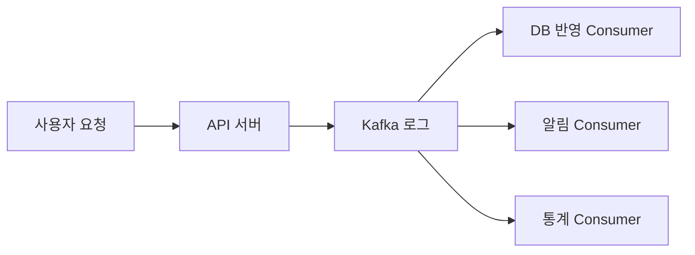

API는 레코드가 Kafka에 받아들여졌다는 사실과 실제 업무 처리가 끝났다는 사실을 구분해야 한다. `202 Accepted`가 어울리는 작업도 있고, DB 커밋을 확인한 뒤 `200 OK`를 반환해야 하는 작업도 있다. Kafka 도입은 이 의미를 대신 결정해 주지 않는다.

## 1.2 Kafka는 작업이 사라지는 큐가 아니라 보존되는 로그다

전통적인 작업 큐를 떠올리면 소비자가 메시지를 가져간 뒤 큐에서 사라진다고 생각하기 쉽다. Kafka의 레코드는 소비 여부와 무관하게 토픽의 보존 정책에 따라 남는다. 소비자는 레코드를 삭제하는 대신 "어디까지 읽었는지"를 offset으로 기록한다.

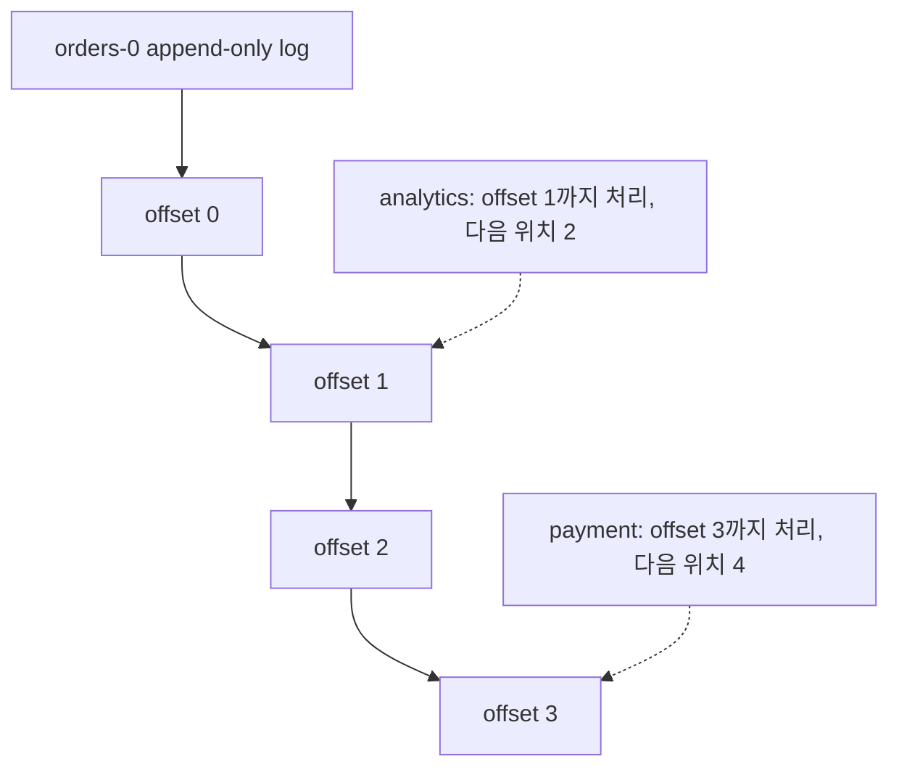

화살표는 마지막으로 처리한 레코드를 가리키지만 실제 committed offset 값은 그다음에 읽을 위치다. 같은 토픽을 결제 그룹과 통계 그룹이 독립적으로 읽을 수 있고, 필요하면 과거 offset으로 되돌아가 재처리할 수 있다. 이 성질이 이벤트 기반 시스템, CDC, 스트림 처리에서 Kafka가 강한 이유다.

## 1.3 Kafka가 잘 맞는 경우

| 요구 | Kafka가 주는 성질 |
|---|---|
| 생산자와 소비자의 속도가 다르다 | 로그가 순간적인 속도 차이를 완충한다. |
| 같은 데이터를 여러 시스템이 독립적으로 사용한다 | Consumer Group마다 별도 offset을 가진다. |
| 장애 뒤 과거 데이터를 다시 처리해야 한다 | 보존 기간 안에서 offset을 되돌릴 수 있다. |
| 키 단위 순서와 수평 확장이 함께 필요하다 | 파티션이 순서 단위이자 병렬 처리 단위가 된다. |
| 지속적인 이벤트 스트림을 저장하고 처리한다 | Connect와 Streams 생태계를 활용할 수 있다. |

## 1.4 Kafka를 쓰지 않는 편이 나은 경우

- 요청 하나에 즉시 답하는 단순 RPC가 전부인 경우
- 소비자 하나가 잠깐 수행할 작업이고 재생이나 다중 구독이 필요 없는 경우
- 토픽 전체의 절대적인 전역 순서와 높은 병렬성을 동시에 요구하는 경우
- 큰 이미지나 동영상 파일 자체를 Kafka에 장기 저장하려는 경우
- 운영 인력 없이 브로커, 파티션, 보존, 보안, 장애 복구 비용을 감당할 수 없는 경우
- 외부 DB와 HTTP 호출까지 자동으로 정확히 한 번 실행될 것이라 기대하는 경우

Kafka는 시스템의 결합도를 낮출 수 있지만, 운영해야 할 분산 시스템 하나를 추가한다. 단순한 문제에 Kafka를 넣으면 복잡성만 늘어난다.

## 1.5 첫 번째 설계 질문

Kafka 도입 전에 다음 계약을 글로 적어야 한다.

1. 생산자는 언제 성공 응답을 보내는가?
2. 레코드는 얼마나 오래 보존하는가?
3. 같은 레코드가 다시 와도 소비자는 안전한가?
4. 순서가 필요한 최소 업무 단위는 무엇인가?
5. 소비가 밀렸을 때 허용 가능한 최대 시간은 얼마인가?
6. 처리 실패를 재시도할 것인가, 격리할 것인가, 버릴 것인가?

이 질문에 답하지 못한 채 `KafkaTemplate`부터 추가하면, 기술은 붙었지만 보장 범위는 설명할 수 없는 시스템이 된다.

### 장 점검

- Kafka와 작업 큐의 가장 큰 차이를 "소비 후 삭제"가 아니라 보존과 offset 관점에서 설명할 수 있는가?
- API 응답 성공, Kafka 기록 성공, Consumer 처리 성공을 각각 구분할 수 있는가?
- Kafka가 부적합한 사례 하나를 자신의 프로젝트에 대입할 수 있는가?

---

# 2. 레코드 한 건으로 보는 전체 아키텍처

## 2.1 구성요소보다 흐름을 먼저 본다

레코드 한 건이 이동하는 순서는 다음과 같다.

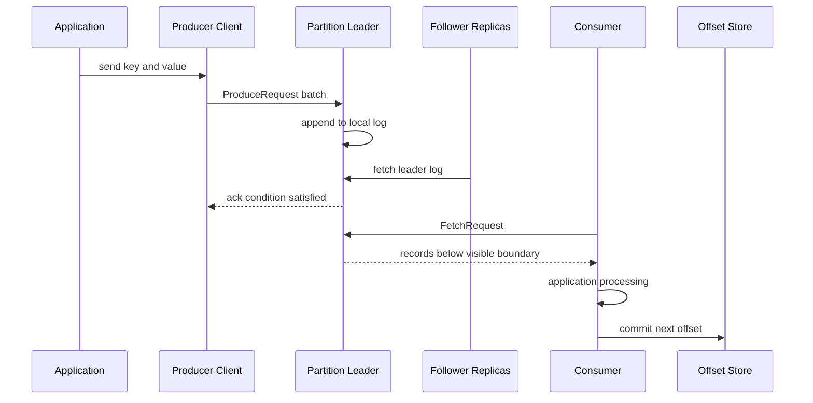

이 그림에서 서로 다른 성공 지점이 보인다.

- `send()` 호출: 클라이언트 버퍼에 넣기 시작한 시점일 수 있다.
- Produce 응답: `acks` 조건을 만족한 시점이다.
- Consumer fetch: 읽을 수 있는 경계까지 레코드를 받은 시점이다.
- 업무 처리 완료: DB나 외부 시스템 반영까지 끝난 시점이다.
- offset commit: 다음 소비 시작 위치를 저장한 시점이다.

이 다섯 시점을 한 문장으로 "Kafka 처리 성공"이라고 부르면 장애 상황을 설명할 수 없다.

## 2.2 Broker, Topic, Partition

**Broker**는 Kafka 서버 프로세스가 실행되는 노드다. 클러스터는 여러 broker로 구성되고, 각 broker는 여러 파티션의 leader 또는 follower replica를 가진다.

**Topic**은 레코드를 분류하는 논리적 이름이다. 실제 저장과 순서의 단위는 **Partition**이다. 하나의 파티션은 끝에만 추가되는 로그이며 각 레코드는 증가하는 offset을 갖는다.

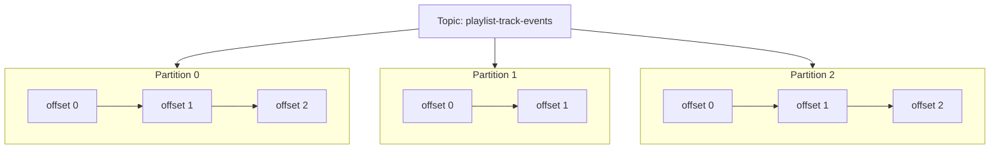

offset 2가 토픽 전체에서 세 번째 레코드라는 뜻은 아니다. offset은 파티션 안에서만 의미가 있다. Kafka가 보장하는 순서도 파티션 내부 순서다.

## 2.3 Leader와 Follower

각 파티션 replica 중 하나가 leader가 된다. 일반적인 produce와 fetch는 leader를 대상으로 수행된다. follower는 leader의 로그를 pull 방식으로 따라간다.

Replication Factor가 3이면 동일 파티션의 replica가 세 broker에 배치될 수 있다. 그러나 replica가 세 개라는 사실만으로 세 개 모두 최신이라는 뜻은 아니다. 현재 leader를 충분히 따라가는 집합이 ISR이며, 5장에서 이 차이를 자세히 다룬다.

## 2.4 Producer는 어느 broker로 보내야 하는지 안다

Producer는 bootstrap server 한 곳에 모든 레코드를 전달하지 않는다. bootstrap 주소는 클러스터 metadata를 얻기 위한 시작점이다. 클라이언트는 metadata에서 각 파티션 leader의 위치를 확인하고 대상 broker로 직접 요청한다.

따라서 `bootstrap.servers`에 모든 broker를 적는 목적은 요청을 라운드로빈 분산하는 것이 아니라, 일부 주소가 죽어도 metadata를 얻을 시작점을 확보하는 데 있다.

## 2.5 Consumer Group은 일을 나누고, Group마다 다시 읽는다

같은 group 안에서는 하나의 파티션이 동시에 한 consumer에만 할당된다. 파티션이 3개이고 consumer가 2개라면 한 consumer는 두 파티션, 다른 consumer는 한 파티션을 맡는다. consumer가 5개라면 두 개는 놀 수 있다.

다른 group은 독립적인 committed offset을 가진다. 새 group에 committed offset이 없거나 보존 범위를 벗어났다면 `auto.offset.reset`을 적용한다. Java consumer의 기본값인 `latest`에서는 처음부터 읽지 않으며, 과거 전체를 읽으려면 `earliest` 또는 명시적인 offset reset이 필요하다.

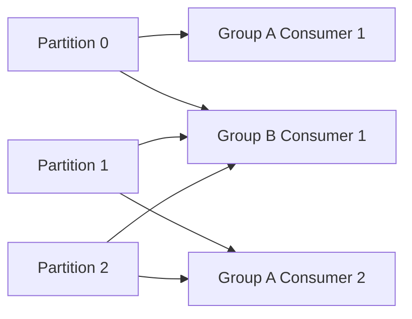

## 2.6 Offset은 레코드의 상태가 아니라 소비자의 위치다

현재 position과 committed offset을 구분해야 한다.

- **position**: consumer가 다음 `poll()`에서 읽을 위치
- **committed offset**: 재시작이나 재할당 때 다시 시작할 위치

offset 42를 정상 처리했다면 보통 43을 커밋한다. 커밋 값은 "마지막으로 처리한 offset"이 아니라 "다음에 읽을 offset"이다. Consumer Group의 커밋 정보는 내부 compacted topic인 `__consumer_offsets`에 저장된다.

## 2.7 문맥마다 다른 Commit

이 책에서 commit은 네 문맥에 등장한다. 같은 단어지만 완료되는 대상과 보장 범위가 다르다.

| 표현 | 완료되는 것 | 포함하지 않는 것 |
|---|---|---|
| 복제 커밋 경계 | 파티션 레코드가 ISR 복제 조건을 만족해 HW 이하가 됨 | Consumer 업무 처리 |
| 오프셋 커밋 | Consumer Group의 다음 시작 위치 저장 | DB 반영의 원자성 |
| Kafka 트랜잭션 커밋 | Kafka 출력 레코드와 입력 오프셋의 원자적 공개 | 일반 DB와 HTTP 호출 |
| DB 커밋 | 해당 데이터베이스 트랜잭션 확정 | Kafka 오프셋과 다른 시스템 |

장애를 설명할 때는 "커밋됐다"고 줄이지 말고 어느 커밋인지 붙여 말한다.

## 2.8 Data Plane과 Control Plane

사용자 레코드가 흐르는 경로를 data plane이라 하고, 토픽·파티션·리더·브로커 등록 같은 metadata를 관리하는 경로를 control plane이라 한다.

Kafka 4.x의 control plane은 KRaft controller quorum이 담당한다. `__cluster_metadata` 로그의 active controller와 follower controller들이 metadata를 합의한다. 이 controller가 사용자 토픽의 모든 레코드를 대신 전달하는 것은 아니다.

### 장 점검

- bootstrap server와 partition leader의 차이를 설명할 수 있는가?
- consumer 8개를 띄웠는데 3개만 일하는 이유를 설명할 수 있는가?
- offset 10을 커밋했다는 말이 무엇을 뜻하는가?
- controller quorum 장애와 데이터 partition leader 장애를 구분할 수 있는가?

---

# 3. 이벤트, 토픽, 키, 스키마 설계

## 3.1 Kafka 설계는 토픽 이름보다 업무 계약에서 시작한다

`playlist-events`라는 토픽을 먼저 만들고 무엇이든 넣는 방식은 오래가지 못한다. 생산자와 소비자가 공유할 계약을 먼저 정해야 한다.

```json
{
  "eventId": "9d54c09a-9fb2-4fd1-91fe-fb5a4f217f0d",
  "eventType": "TRACK_ADDED",
  "occurredAt": "2026-07-18T10:15:30Z",
  "playlistUid": "pl-123",
  "trackUid": "tr-456",
  "actorUid": "user-7",
  "schemaVersion": 1
}
```

좋은 이벤트는 이미 발생한 사실을 과거형으로 표현한다. 반면 `ADD_TRACK`은 아직 수행 여부가 결정되지 않은 command에 가깝다. 둘은 실패와 재처리 의미가 다르다.

- `TrackAdded`: 추가가 완료되었다는 사실. 소비자는 이 사실을 반영한다.
- `AddTrack`: 추가 작업을 수행하라는 요청. 소비자가 검증하고 성공 또는 실패를 결정한다.

Plys처럼 HTTP 요청을 Kafka로 넘긴 뒤 Consumer가 실제 DB 저장을 수행한다면, 이름이 `track-added`여도 의미는 사실상 command일 수 있다. 이름과 실제 의미가 다르면 API 응답, 재시도, 실패 처리에 혼란이 생긴다.

## 3.2 Key는 순서 보장의 업무 경계다

Kafka는 key가 있는 레코드를 기본적으로 같은 key가 같은 파티션으로 가도록 선택한다. 따라서 key는 단순히 분산을 위한 문자열이 아니라 "함께 순서가 지켜져야 하는 최소 단위"다.

플레이리스트 곡 추가와 삭제 순서가 중요하다면 `playlistUid`는 합리적인 key 후보다. 같은 플레이리스트의 이벤트는 같은 파티션으로 가고, 서로 다른 플레이리스트는 여러 파티션에서 병렬 처리할 수 있다.

하지만 다음 함정이 있다.

- 특정 플레이리스트 하나에 트래픽이 집중되면 hot partition이 된다.
- 파티션 수를 늘리면 key의 파티션 매핑이 달라질 수 있다.
- 추가와 삭제를 서로 다른 토픽으로 보내면 같은 key라도 토픽 간 순서는 없다.
- key가 null이면 배치 효율을 위한 sticky 선택이 사용될 수 있어 업무 단위 순서를 기대하면 안 된다.

## 3.3 토픽 경계를 나누는 기준

토픽은 다음 조건이 다를 때 나누는 편이 자연스럽다.

- 보존 기간이나 compaction 정책이 다르다.
- 접근 권한과 민감도가 다르다.
- 처리량과 파티션 수 요구가 크게 다르다.
- 이벤트의 소유 팀과 스키마 진화 주기가 다르다.
- 소비자가 반드시 함께 보아야 하는 순서 경계가 다르다.

반대로 이름만 다르고 동일 aggregate의 순서를 함께 지켜야 한다면 토픽 분리가 오히려 위험할 수 있다. `track-added`와 `track-removed`를 분리하면 각각의 토픽 내부 순서는 지킬 수 있지만, 두 동작의 교차 순서는 보장하지 못한다.

## 3.4 Headers와 Value의 경계

Headers에는 trace ID, correlation ID, content type, source 같은 전달 문맥을 넣는다. 업무 사실의 핵심 값은 value에 둔다. 소비자가 비즈니스 판단을 위해 반드시 알아야 하는 값을 header에만 넣으면, 스키마 관리와 재처리가 어려워진다.

권장 메타데이터는 다음과 같다.

| 위치 | 필드 | 목적 |
|---|---|---|
| Value envelope | `eventId` | 소비자 멱등성 키와 추적 |
| Value envelope | `eventType` | 이벤트 종류 구분 |
| Value envelope | `occurredAt` | 업무 발생 시각 |
| Value envelope | `producer` | 발행 주체와 버전 확인 |
| Value envelope | `schemaVersion` | 형식 진화 |
| Header | `correlationId` | 요청 전체 추적 |
| Header | `causationId` | 어떤 이벤트가 이 이벤트를 만들었는지 추적 |

## 3.5 스키마는 내부 구현이 아니라 API다

Kafka 토픽은 여러 소비자가 각자 속도로 읽는다. 생산자가 필드를 바꾼 순간 모든 소비자를 동시에 배포할 수 없으므로 스키마 호환성이 필요하다.

안전한 진화의 기본 원칙은 다음과 같다.

- 필드 추가는 기본값 또는 optional 의미를 함께 정의한다.
- 기존 필드의 의미를 바꾸지 않는다. 의미가 달라지면 새 필드를 만든다.
- 숫자를 문자열로 바꾸는 식의 타입 변경을 가볍게 하지 않는다.
- 소비자가 모르는 필드를 무시할 수 있게 한다.
- 이벤트 이름과 필드에 특정 DB 테이블 구조를 그대로 노출하지 않는다.

Avro, Protobuf, JSON Schema와 Schema Registry는 이 계약을 기계적으로 검사하는 선택지다. JSON만 사용하더라도 계약 테스트와 버전 정책은 필요하다.

## 3.6 큰 payload를 보내지 않는 이유

큰 이미지나 동영상은 object storage에 저장하고 Kafka에는 위치, checksum, 크기, content type을 담은 이벤트를 보내는 편이 낫다. 큰 레코드는 producer, broker, replica fetch, consumer의 크기 제한과 메모리를 모두 건드린다. 설정 한 곳만 키우면 해결되지 않는다.

## 3.7 설계 예제

플레이리스트의 변경 사실을 하나의 토픽으로 표현한다면 다음과 같이 설계할 수 있다.

```text
topic: plys.playlist.track-events.v1
key: playlistUid
value: TrackAdded | TrackRemoved
retention: 업무상 재처리 기간에 맞춤
partitions: 목표 처리량과 consumer 병렬성으로 산정
```

이 구조는 같은 플레이리스트의 추가와 삭제 순서를 한 파티션에서 유지한다. 다만 이벤트를 실제 DB 변경 후 발행할지, DB 변경을 수행할 command로 사용할지는 별도 결정이다. 8장과 9장에서 이 차이를 실패 시나리오로 다룬다.

### 장 점검

- 자신의 이벤트가 사실인지 command인지 설명할 수 있는가?
- key를 바꾸면 어떤 순서 보장이 사라지는가?
- 두 토픽 사이의 순서를 Kafka가 보장하지 않는 이유는 무엇인가?
- 스키마에 optional 필드를 추가할 때 과거 consumer가 안전한가?

---

# 4. 로그 저장 엔진과 데이터 수명

## 4.1 파티션은 디스크에서 여러 세그먼트가 된다

파티션은 논리적으로 하나의 긴 로그지만, 디스크에서는 여러 segment 파일로 나뉜다. 계속 쓰는 파일은 active segment 하나이며, 크기나 시간이 기준을 넘으면 닫히고 새 segment가 열린다.

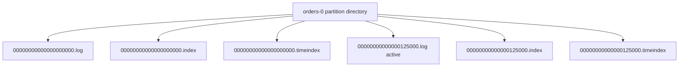

파일명은 해당 segment의 base offset이다. `.log`에는 record batch가 순차 기록되고, `.index`는 상대 offset에서 파일 위치를 찾는 sparse index, `.timeindex`는 timestamp 기반 탐색을 돕는 index다. 모든 레코드마다 index entry를 만들지 않기 때문에 index로 가까운 지점을 찾고 로그를 조금 순차 스캔한다.

## 4.2 순차 I/O와 Page Cache

Kafka가 디스크를 사용하면서도 높은 처리량을 내는 이유는 데이터를 메모리 DB처럼 전부 JVM heap에 올려서가 아니다. 로그 끝에 순차 append하고, 운영체제 page cache를 적극 활용하며, producer와 consumer가 batch 단위로 통신하기 때문이다.

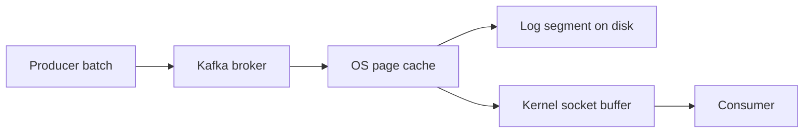

최근에 기록된 데이터는 page cache에 있을 가능성이 높다. 소비자는 디스크를 다시 읽지 않고 cache에서 데이터를 받을 수 있다. 일반적인 plaintext 전송에서는 `sendfile` 계열 경로로 사용자 공간 복사를 줄일 수 있다. TLS를 사용하면 이 zero-copy 경로를 그대로 쓸 수 없으므로 보안과 CPU·처리량을 함께 측정해야 한다.

`flush.ms=1`처럼 매번 디스크 동기화를 강제한다고 무조건 더 안전한 것도 아니다. Kafka의 내구성은 복제와 ACK 계약을 함께 봐야 하며, 과도한 flush는 처리량과 tail latency를 크게 악화시킬 수 있다.

## 4.3 Retention은 레코드별 타이머가 아니다

`cleanup.policy=delete`인 토픽은 보존 시간이나 파티션 크기를 기준으로 오래된 segment를 삭제한다.

- `retention.ms`: 보존 시간
- `retention.bytes`: 파티션별 보존 크기
- `segment.bytes`, `segment.ms`: segment가 닫히는 조건
- `file.delete.delay.ms`: 삭제 대상으로 표시한 파일을 실제 제거하기 전 지연

삭제는 segment 단위이며 주기적으로 검사된다. `retention.ms=1h`라고 해서 레코드가 정확히 한 시간 뒤 한 건씩 사라지지 않는다. active segment가 닫히는 시점과 cleanup 검사 주기 때문에 더 오래 남을 수 있다.

## 4.4 Compaction은 최신 상태를 남긴다

`cleanup.policy=compact`는 key별 최신 value를 남기는 정책이다. 같은 key의 과거 값은 cleaner가 닫힌 segment를 정리하면서 제거할 수 있다.

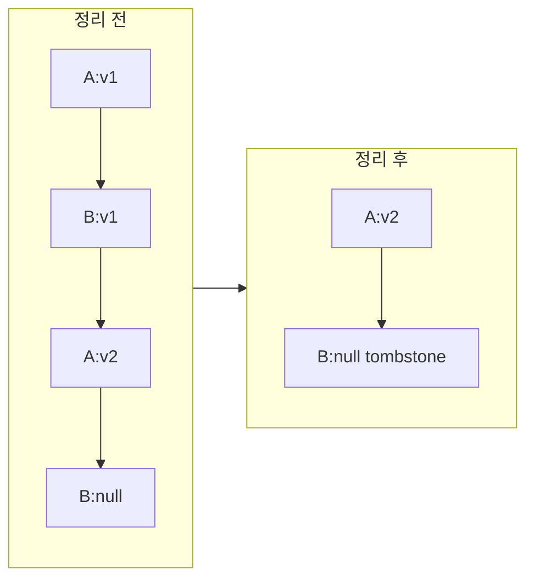

중요한 성질은 다음과 같다.

- compaction은 즉시 수행되지 않는다.
- offset은 다시 번호 매기지 않으므로 빈 offset 구간이 생길 수 있다.
- key가 null이면 최신 상태를 판단할 수 없다.
- value가 실제 null인 레코드는 tombstone이며 key 삭제를 뜻한다.
- tombstone도 `delete.retention.ms` 이후 제거될 수 있다.
- `compact,delete`를 함께 쓰면 최신 key라도 전체 보존 정책에 따라 결국 삭제될 수 있다.

Compacted topic은 캐시나 KTable 상태 복구에 유용하지만, 완전한 영구 DB라고 생각하면 안 된다.

## 4.5 장애 뒤 복구

Broker가 비정상 종료되면 시작 시 segment를 검사하고 손상된 tail을 정리하며 필요한 index를 다시 만든다. segment 수가 많고 로그가 크면 복구 시간이 길어진다. `num.recovery.threads.per.data.dir`는 데이터 디렉터리별 복구 병렬성에 영향을 준다.

따라서 segment를 지나치게 작게 잡으면 retention은 세밀해질 수 있지만 파일 수, index, 복구, metadata 관리 비용이 늘어난다. 저장 설계는 보존 기간만이 아니라 재시작 시간과 파일 시스템 자원까지 포함한다.

### 장 점검

- 토픽, 파티션, segment의 관계를 디렉터리와 파일 관점에서 설명할 수 있는가?
- retention이 정확한 레코드 만료 시각을 보장하지 않는 이유는 무엇인가?
- compaction 뒤 offset에 빈 구간이 생겨도 정상인 이유는 무엇인가?
- tombstone과 문자열 `"null"`은 왜 다른가?

---

# 5. 복제, 내구성, KRaft

처음 읽을 때는 5.1~5.4와 5.6의 KRaft 기본 구조를 먼저 이해한다. ELR, dynamic controller quorum, ZooKeeper migration은 기존 클러스터의 운영·업그레이드를 맡을 때 다시 읽어도 된다.

## 5.1 Replication Factor와 ISR은 다르다

Replication Factor는 배치된 전체 replica 수다. ISR은 그중 leader를 충분히 따라가고 있는 동기 replica 집합이다. RF가 3이어도 장애나 지연 때문에 ISR은 2 또는 1이 될 수 있다.

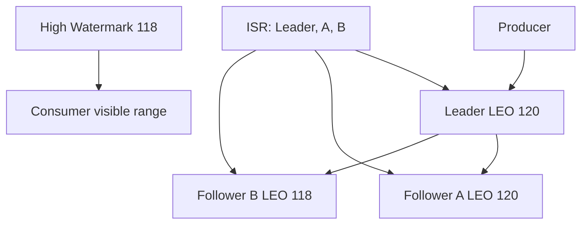

**LEO(Log End Offset)**는 각 replica가 가진 로그 끝의 다음 위치다. **HW(High Watermark)**는 ISR 복제에 따른 커밋 경계다. `read_uncommitted` consumer는 HW까지 읽을 수 있지만, `read_committed` consumer는 열린 transaction이 있으면 LSO, 즉 첫 미완료 transaction 직전까지만 읽는다. Leader에만 있는 tail은 장애 뒤 사라질 수 있으므로 HW를 넘어 공개하지 않는다.

## 5.2 `acks`가 선택하는 성공 기준

| `acks` | Producer가 성공으로 판단하는 시점 | 주요 위험 |
|---|---|---|
| `0` | broker 응답을 기다리지 않음 | 전송 실패를 알기 어렵다. |
| `1` | leader local append 완료 | follower 복제 전 leader 장애 시 손실 가능 |
| `all` | 현재 ISR 전체가 복제 | ISR 부족 시 쓰기 실패, 지연 증가 가능 |

`acks=all`은 RF의 모든 replica를 기다린다는 뜻이 아니다. 현재 ISR 전체를 기다린다. ISR 밖에 있거나 죽은 replica까지 기다리지는 않는다.

## 5.3 `min.insync.replicas`는 ACK 수가 아니라 쓰기 허용선이다

RF 3, `min.insync.replicas=2`, `acks=all`을 생각하자.

- ISR 3: 세 ISR에 복제된 뒤 성공
- ISR 2: 두 ISR에 복제된 뒤 성공
- ISR 1: 쓰기 거부

`min.insync.replicas=2`라고 항상 두 개만 ACK하면 끝나는 것이 아니다. `acks=all`은 현재 ISR 전체를 기다리고, min ISR은 쓰기를 받아도 되는 최소 ISR 수를 정한다.

이 조합은 데이터 손실 가능성과 쓰기 가용성의 계약이다. 장애 때 무조건 쓰고 싶다고 min ISR을 1로 낮추면, 마지막 replica 장애에서 커밋 데이터 생존 여유가 줄어든다.

## 5.4 Leader 장애와 Leader Epoch

Leader가 바뀌면 새 epoch가 부여된다. Leader epoch는 오래된 leader가 뒤늦게 돌아와 자신이 여전히 leader인 것처럼 쓰는 상황을 차단하고, follower가 divergent tail을 올바른 지점까지 잘라내는 데 쓰인다.

`unclean.leader.election.enable=true`는 ISR에 없는 replica라도 leader가 될 수 있게 해 가용성을 높일 수 있지만, 최신 커밋 데이터를 잃을 수 있다. 기본적인 운영 판단은 "서비스를 살릴 것인가"가 아니라 "허용한 데이터 손실 범위 안에서 살릴 수 있는가"다.

## 5.5 Eligible Leader Replicas

Kafka 4.x의 ELR은 ISR 밖이지만 최소한 HW까지의 커밋 데이터를 가진 것으로 controller가 판단한 replica 집합이다. ISR이 비었을 때 clean leader 후보 범위를 넓혀 last replica standing 상황의 커밋 데이터 손실 위험을 줄인다.

ELR은 모든 데이터 손실을 막지 않는다. `acks=0/1`로 커밋 경계에 들어오지 못한 데이터까지 보장하지 않으며, 기존 클러스터는 feature level을 확인해야 한다. 새 클러스터와 업그레이드 클러스터의 활성 상태를 같다고 단정하면 안 된다.

## 5.6 KRaft는 metadata의 복제 로그다

Kafka 4.x에는 ZooKeeper 모드가 없다. KRaft controller quorum이 토픽, 파티션, 브로커 등록, 리더와 ISR 같은 metadata를 `__cluster_metadata` 로그에 기록하고 합의한다.

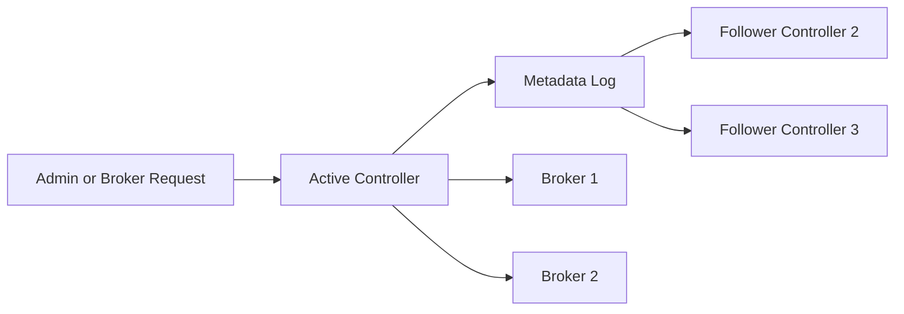

Controller 3대는 과반수 2대가 살아야 metadata 변경과 leader 선출을 계속할 수 있다. 5대면 2대 장애까지 견딘다. 데이터 토픽의 RF와 controller 수는 별개의 용량·장애 설계다.

## 5.7 Combined와 Isolated 역할

`process.roles=broker,controller`는 한 프로세스가 두 역할을 함께 수행하는 combined 구성이다. 개발이나 작은 환경은 단순하지만 broker 부하와 장애가 control plane에 함께 영향을 준다. 중요한 운영 환경은 controller를 broker와 분리해 장애 영역을 나누는 구성을 검토한다.

Kafka 4.3은 static과 dynamic controller quorum을 모두 지원한다. Dynamic quorum은 `kraft.version=1` 기능이며 `controller.quorum.bootstrap.servers`를 사용한다. 시작한 controller가 기본적으로 자동 voter가 되는 것은 아니므로 추가 절차를 따라야 한다.

## 5.8 ZooKeeper 클러스터의 업그레이드 경계

ZooKeeper 클러스터를 Kafka 4.x에서 바로 KRaft로 바꾸는 것이 아니다. Kafka 3.9 브리지 버전에서 migration을 완료하고 ZooKeeper 의존성을 제거한 뒤 4.x로 업그레이드한다. Metadata feature finalization과 downgrade 가능 여부도 업그레이드 전에 확인해야 한다.

### 장 점검

- RF 3과 ISR 3은 같은 말인가?
- `acks=all`, ISR 3, min ISR 2일 때 몇 replica를 기다리는가?
- HW를 넘은 leader tail을 consumer에게 바로 공개하지 않는 이유는 무엇인가?
- Controller quorum 복제와 사용자 topic 복제의 차이는 무엇인가?

---

# 6. Producer와 Java 클라이언트

## 6.1 `send()` 내부 경로

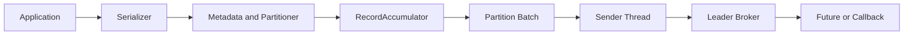

`send()`는 일반적으로 비동기다. serializer가 key와 value를 byte array로 만들고, metadata와 partitioner가 대상 파티션을 정한다. RecordAccumulator는 파티션별 batch를 만들고 Sender thread가 broker로 전송한다.

비동기라는 말이 절대 block하지 않는다는 뜻은 아니다. metadata를 얻지 못하거나 `buffer.memory`가 가득 차면 최대 `max.block.ms`까지 기다릴 수 있다.

## 6.2 Key와 파티션 선택

Key가 있으면 기본 partitioner는 key hash를 이용해 파티션을 고른다. Key가 없으면 batch 효율을 높이는 sticky 방식으로 한 파티션에 묶어 보내다가 전환할 수 있다.

Custom partitioner를 만들기 전에 다음을 확인한다.

- key가 정말 순서 경계를 표현하는가?
- null key를 허용해도 되는가?
- 특정 key가 전체 트래픽을 독점하지 않는가?
- 파티션 증가 뒤 기존 key의 매핑 변화가 허용되는가?

## 6.3 Batching과 Compression

Kafka 4.3.1에 포함된 Java producer의 주요 기본값은 다음과 같다. 다른 언어 client와 Spring 버전의 실제 client 의존성에는 그대로 적용하지 않는다.

| 설정 | 4.3.1 Java client 기본값 | 의미 |
|---|---:|---|
| `batch.size` | `16384` bytes | 파티션별 batch 목표 상한 |
| `linger.ms` | `5` ms | 덜 찬 batch의 최대 대기 시간 |
| `compression.type` | `none` | batch 압축 방식 |
| `buffer.memory` | `33554432` bytes | 전송 대기 레코드 버퍼의 근사 총량 |

Batch가 먼저 차면 linger를 다 기다리지 않는다. Broker backpressure가 있으면 실제 대기는 linger보다 길 수 있다. 압축은 batch 단위이므로 batch가 잘 모일수록 압축률도 좋아질 수 있다. `gzip`, `snappy`, `lz4`, `zstd` 선택은 payload와 CPU, 네트워크를 실제로 측정해 결정한다.

반복문에서 매번 `send().get()`을 호출하거나 매 레코드마다 `flush()`하면 batch 장점을 대부분 잃는다.

## 6.4 Retry와 Timeout

Kafka 4.3.1 Java producer의 `retries` 기본값은 매우 크지만, 실제 재시도 가능 시간은 보통 `delivery.timeout.ms`가 먼저 제한한다.

- `request.timeout.ms`: 개별 요청 응답을 기다리는 시간
- `delivery.timeout.ms`: `send()` 이후 성공 또는 실패를 최종 보고할 전체 상한
- `retry.backoff.ms`: 재시도 사이의 대기와 관련된 설정

`delivery.timeout.ms`는 `request.timeout.ms + linger.ms`보다 충분히 커야 한다. HTTP timeout보다 Kafka delivery timeout이 훨씬 길면 사용자 요청은 실패했는데 뒤늦게 이벤트가 기록되는 의미도 검토해야 한다.

## 6.5 Idempotent Producer

Idempotence는 Producer ID와 파티션별 sequence number를 사용해 전송 재시도에서 생기는 중복 append를 억제한다. Kafka 4.3.1 Java client에서는 충돌 설정이 없을 때 기본 활성화된다.

안전한 조합은 다음 제약과 연결된다.

- `acks=all`
- `retries > 0`
- `max.in.flight.requests.per.connection <= 5`

Idempotence를 명시적으로 `true`로 두고 충돌 설정을 주면 구성 오류가 난다. 명시하지 않은 상태에서 충돌 설정을 주면 비활성화될 수 있으므로 실제 설정을 확인해야 한다.

가장 중요한 한계는 producer idempotence가 DB 소비의 중복을 막지 않는다는 점이다. 네트워크 재시도로 같은 record가 Kafka log에 중복 기록되는 문제와, consumer가 같은 record를 다시 처리해 DB에 두 번 insert하는 문제는 다른 계층이다.

## 6.6 Future의 성공 의미

Java `KafkaProducer.send()`와 Spring `KafkaTemplate.send()`의 Future 성공은 broker가 설정된 ACK 조건에 따라 레코드를 수락했다는 뜻이다. Consumer의 DB 반영이 끝났다는 뜻이 아니다.

```java
kafkaTemplate.send(topic, key, event)
    .whenComplete((result, ex) -> {
        if (ex != null) {
            log.error("Kafka send failed: eventId={}", event.eventId(), ex);
            return;
        }
        var metadata = result.getRecordMetadata();
        log.info("Kafka ack: partition={}, offset={}",
                metadata.partition(), metadata.offset());
    });
```

HTTP API가 Future를 기다리지 않고 성공을 반환한다면, 발행 실패를 사용자에게 어떻게 전달하고 복구할지 별도 계약이 필요하다.

### 장 점검

- `send()`가 비동기여도 block할 수 있는 두 조건은 무엇인가?
- `batch.size`는 요청 전체 크기인가, 파티션별 batch 크기인가?
- idempotence가 막는 중복과 막지 못하는 중복을 구분할 수 있는가?
- Future 성공 뒤에도 DB에 데이터가 없을 수 있는 이유는 무엇인가?

---

# 7. Consumer, Group, Rebalance, Share Groups

## 7.1 Poll loop가 소비자의 심장이다

Consumer는 broker가 메시지를 밀어 넣어 주는 수동 객체가 아니다. `poll()`로 데이터를 가져오고, group heartbeat와 rebalance 절차에도 참여한다.

```text
while (running) {
    records = consumer.poll(timeout)
    for record in records:
        process(record)
    commit(nextOffsets)
}
```

`max.poll.records`는 한 번의 `poll()`이 애플리케이션에 돌려주는 레코드 수를 제한하지만 underlying fetch 크기 자체를 줄이지는 않는다.

## 7.2 `session.timeout.ms`와 `max.poll.interval.ms`

- `session.timeout.ms`: Classic protocol에서 heartbeat가 끊긴 consumer를 죽은 멤버로 판단하는 시간
- `max.poll.interval.ms`: 애플리케이션이 다음 poll을 호출하지 않는 최대 시간

Consumer process는 살아 있고 heartbeat thread도 동작하지만 한 batch를 너무 오래 처리해 다음 poll이 늦으면 `max.poll.interval.ms`를 넘겨 group에서 제외될 수 있다. 처리 시간이 긴 문제를 session timeout만 늘려 해결하면 원인을 놓친다.

`group.protocol=consumer`에서는 client의 `session.timeout.ms`와 `heartbeat.interval.ms`를 사용하지 않고 broker의 `group.consumer.session.timeout.ms`, `group.consumer.heartbeat.interval.ms`가 이 시간을 제어한다. `max.poll.interval.ms`는 여전히 client의 poll 지연 한계다.

## 7.3 Offset commit과 실패 창

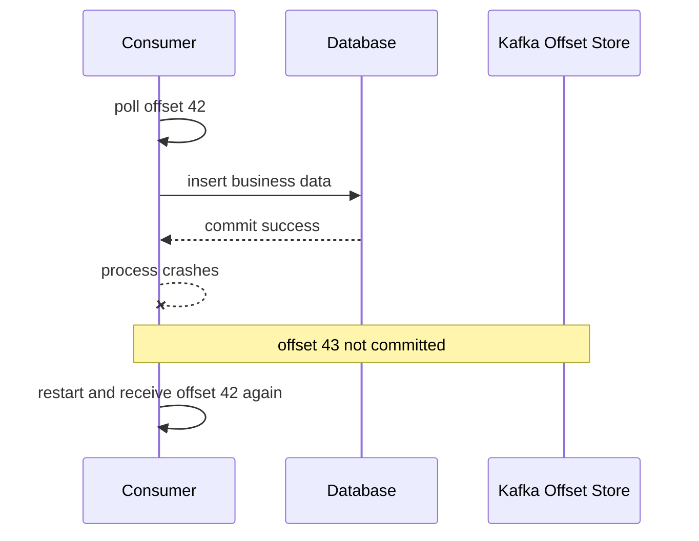

DB 반영 후 offset commit 전에 죽으면 같은 record를 다시 받는다. Commit을 먼저 하고 DB 처리 전에 죽으면 record를 놓칠 수 있다. 보통은 at-least-once를 선택하고 소비자 처리를 멱등하게 만든다.

`commitSync()`는 결과를 확인하기 쉽지만 block한다. `commitAsync()`는 처리량에 유리할 수 있으나 실패 순서와 종료 시 최종 commit을 더 신중하게 다뤄야 한다. 자동 commit도 처리 완료 시점과 맞지 않으면 유실 또는 중복 창을 만든다.

## 7.4 Rebalance

Group에 consumer가 들어오거나 나가고, 구독 토픽의 파티션이 변하거나, consumer가 timeout되면 파티션 할당이 바뀐다.

- Eager 방식은 기존 할당을 한꺼번에 반납하고 다시 배분한다.
- Cooperative 방식은 필요한 파티션을 단계적으로 이동해 중단 범위를 줄인다.
- Static membership은 계획된 짧은 재시작 때 불필요한 rebalance를 줄일 수 있지만 죽은 멤버의 failover가 늦어질 수 있다.

`onPartitionsRevoked`에서는 넘겨줄 파티션의 처리 상태와 offset을 정리하고, `onPartitionsAssigned`에서는 새 할당을 초기화한다. `onPartitionsLost`는 정상 revoke 없이 소유권을 잃은 상황이므로 같은 가정을 쓰면 안 된다.

## 7.5 Classic과 새 Consumer Protocol

Kafka 4.3.1 Java consumer의 `group.protocol` 기본값은 여전히 `classic`이다. KIP-848 기반 `consumer` protocol은 GA지만 사용하려면 명시적으로 선택해야 한다.

새 protocol에서는 heartbeat interval, session timeout, assignor 같은 일부 group 정책이 broker 쪽으로 이동한다. Classic 설정을 그대로 복사해 새 protocol에서도 client가 동일하게 통제한다고 생각하면 안 된다.

## 7.6 Share Groups

이 절은 일반 Consumer Group의 poll, offset commit, rebalance를 이해한 뒤 읽는 확장 주제다. 작업 큐에 가까운 병렬 처리가 필요하지 않다면 첫 독해에서는 건너뛰어도 된다.

일반 Consumer Group은 파티션 하나를 한 consumer에게 배정한다. Share Group은 같은 파티션의 record들을 여러 worker가 record 단위로 획득해 처리할 수 있다.

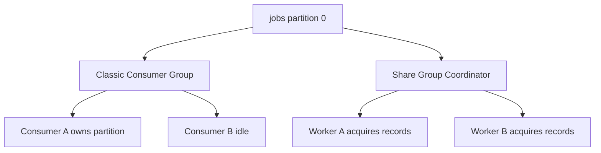

Kafka 4.2부터 production-ready인 Share Groups는 partition 수보다 많은 worker가 작업형 payload를 병렬 처리할 때 유용하다. 대신 일반 group과 같은 partition 처리 순서를 전제로 하면 안 된다. 기본 `share.acknowledgement.mode=implicit`에서는 다음 `poll()` 또는 `commit()`이 전달을 암묵적으로 ACK하며 `ShareConsumer.acknowledge()`를 직접 호출하지 않는다. 처리 완료 뒤 record별 ACK를 통제하려면 `explicit` mode를 사용한다. ACK 전에 worker가 죽거나 lock이 만료되면 record가 다시 전달될 수 있으므로 여전히 멱등성이 필요하다.

Share Groups는 feature와 내부 state topic 조건을 확인해야 한다. 단일 broker 실습에서는 `__share_group_state`의 기본 RF와 min ISR 때문에 그대로 동작하지 않을 수 있다.

### 장 점검

- consumer process가 살아 있어도 rebalance될 수 있는 이유는 무엇인가?
- 처리 완료 전 commit과 처리 완료 후 commit의 실패 결과를 비교할 수 있는가?
- `max.poll.records`를 줄이면 broker fetch byte도 반드시 줄어드는가?
- Share Group이 일반 Consumer Group의 대체제가 아닌 이유는 무엇인가?

---

# 8. 전달 보장과 실패 복구

## 8.1 "정확히 한 번"보다 먼저 경계를 말한다

전달 보장은 한 단어로 시스템 전체에 붙일 수 없다. 경로를 나눠야 한다.

1. Producer에서 Kafka log까지
2. Kafka log에서 Consumer까지
3. Consumer에서 외부 DB나 API까지
4. Kafka 입력에서 Kafka 출력까지

| 모델 | 일반적인 순서 | 결과 |
|---|---|---|
| At-most-once | commit 후 처리 | 유실 가능, 중복 억제 |
| At-least-once | 처리 후 commit | 중복 가능, 유실 억제 |
| Kafka EOS | 결과 record와 입력 offset을 transaction commit | Kafka 내부 read-process-write 원자성 |

## 8.2 멱등한 Consumer

At-least-once를 실용적으로 만드는 핵심은 consumer 멱등성이다. 대표적인 방법은 다음과 같다.

- 업무 테이블에 자연스러운 unique key를 둔다.
- `eventId`를 처리 이력 테이블에 unique로 저장한다.
- 상태 전이를 조건부 update로 만든다.
- 외부 API에 idempotency key를 전달한다.
- 동일 이벤트의 반복 적용 결과가 같도록 연산을 설계한다.

다음은 PostgreSQL 예시다. 처리 이력 insert가 실제로 성공한 경우에만 업무 update를 수행한다.

```sql
begin;

with inserted as (
    insert into processed_event(event_id, processed_at)
    values (:event_id, now())
    on conflict do nothing
    returning event_id
)
update account
set balance = balance + :amount
where account_id = :account_id
  and exists (select 1 from inserted);

commit;
```

처리 이력과 업무 변경이 같은 DB transaction에 있어야 한다. 이미 처리한 이벤트인지 조회한 뒤 별도 transaction으로 update하면 경쟁 조건이 생긴다.

## 8.3 Kafka Transaction

Kafka의 consume-transform-produce 흐름은 output records와 consumed offsets를 하나의 Kafka transaction으로 묶을 수 있다.

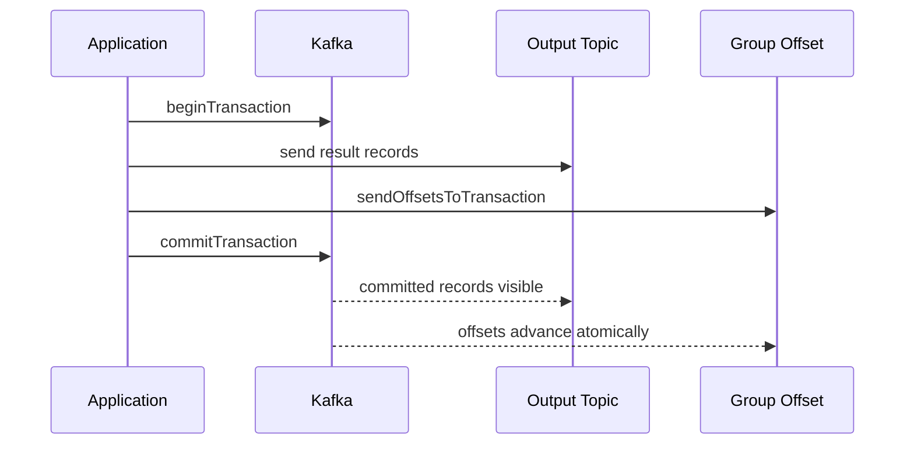

Downstream consumer는 `isolation.level=read_committed`를 사용해야 aborted transaction을 건너뛴다. 열린 transaction이 있으면 Last Stable Offset 때문에 뒤의 커밋 record가 잠시 보이지 않을 수 있다.

Kafka transaction이 포함하지 않는 것은 명확하다.

- 일반 DB commit
- HTTP API 호출
- 파일 쓰기
- 이메일 발송

이 외부 부수효과는 Outbox, 멱등성, 보상 작업, 대사 절차로 해결한다.

## 8.4 Retry는 시간 이동이고, DLT는 운영 책임이다

재시도는 오류를 없애지 않는다. 같은 처리를 미래에 다시 실행한다.

- 일시 오류: 제한된 횟수와 backoff로 재시도
- 영구 검증 오류: 즉시 DLT 또는 별도 실패 상태
- 역직렬화 오류: listener 전에 실패하므로 별도 처리 필요
- 순서가 중요한 오류: 뒤 record를 계속 처리할지 멈출지 결정

Retry topic 방식은 실패 record를 다른 topic으로 보내 시간 뒤 처리한다. 원본 파티션을 막지 않는 대신 원래 순서를 잃을 수 있다. DLT에는 원본 topic, partition, offset, key, payload 또는 안전한 참조, 예외 종류, 시도 횟수, 발생 시각을 남겨야 한다.

DLT는 쓰레기통이 아니다. 다음이 없으면 실패를 숨기는 장치가 된다.

- DLT 적재량과 증가율 경보
- 원인 수정 뒤 재처리 절차
- 재처리 시 멱등성 보장
- 민감 정보 보존 정책
- DLT publish 자체의 실패 처리

## 8.5 실패 매트릭스

| 실패 지점 | 가능한 결과 | 필요한 대응 |
|---|---|---|
| Producer send 전 process 종료 | record 없음 | Outbox 또는 요청 재시도 |
| Broker 기록 후 ACK 유실 | Producer retry 중복 가능 | idempotent producer |
| Consumer DB commit 전 종료 | record 재전달 | 정상 재시도 |
| DB commit 후 offset commit 전 종료 | DB 중복 가능 | idempotent consumer |
| Offset commit 후 외부 처리 전 종료 | 외부 처리 유실 | commit 순서 재설계 |
| DLT publish 실패 | poison record 반복 또는 유실 | recoverer 실패 정책과 경보 |

### 장 점검

- Exactly-once라고 말할 때 어느 경계인지 먼저 설명할 수 있는가?
- Producer idempotence와 Consumer 멱등성의 차이는 무엇인가?
- Retry topic이 순서를 깨뜨릴 수 있는 이유는 무엇인가?
- DLT에 쌓인 record를 다시 원본 토픽에 넣기 전에 무엇을 확인해야 하는가?

---

# 9. DB 정합성, Outbox, CDC, Kafka Connect

## 9.1 가장 위험한 코드는 두 번 쓰는 코드다

애플리케이션이 DB를 갱신한 뒤 Kafka 이벤트를 발행한다고 하자.

```text
DB commit 성공 -> process 종료 -> Kafka send 미실행
```

DB에는 주문이 있지만 이벤트는 없다. 반대로 Kafka 발행 후 DB commit이 실패하면 소비자에게는 존재하지 않는 주문 이벤트가 보일 수 있다. 이것이 dual write 문제다.

Kafka transaction과 DB transaction은 기본적으로 서로 다른 transaction manager다. `@Transactional` 하나로 두 시스템이 하나의 원자적 commit을 하는 것은 아니다.

## 9.2 Transactional Outbox

Outbox는 업무 데이터와 발행할 이벤트를 같은 DB transaction에 기록한다.

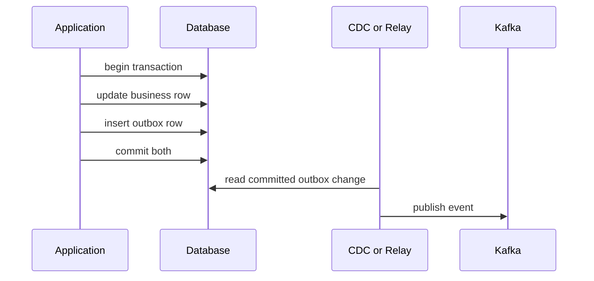

업무 row와 outbox row가 함께 commit되거나 함께 rollback되므로 "DB는 성공했는데 발행 근거가 없음"이라는 창을 제거한다. Relay가 Kafka publish 뒤 outbox 처리 표시 전에 죽으면 재발행할 수 있으므로 producer와 consumer의 멱등성은 여전히 필요하다.

Outbox table의 예시는 다음과 같다.

```sql
create table outbox_event (
    event_id uuid primary key,
    aggregate_type varchar(100) not null,
    aggregate_id varchar(100) not null,
    event_type varchar(100) not null,
    payload jsonb not null,
    occurred_at timestamptz not null,
    published_at timestamptz
);
```

Polling relay는 구현이 단순하지만 polling 부하, 잠금, 중복 claim을 다뤄야 한다. CDC는 DB transaction log에서 commit된 변경 순서를 읽을 수 있지만, 보장 범위는 source shard, table, connector task와 Kafka partition 경계에 제한된다. Aggregate ID를 Kafka key로 사용하고 consumer가 aggregate version을 검증해야 하는 경우도 있다. Connector와 schema, 복구 offset도 별도로 운영해야 한다.

## 9.3 CDC에서 알아야 할 offset

CDC source의 offset은 Kafka partition offset과 다르다. MySQL binlog 위치, PostgreSQL LSN처럼 외부 source에서 어디까지 읽었는지를 뜻한다. Connector가 재시작했을 때 이 위치에서 다시 시작한다.

Kafka에 기록된 뒤에는 별도의 topic-partition offset이 생긴다. 두 offset을 같은 값처럼 생각하면 복구 지점을 잘못 판단한다.

## 9.4 Kafka Connect의 구조

Kafka Connect는 외부 시스템과 Kafka 사이의 반복적인 데이터 이동을 플러그인으로 운영하는 runtime이다.

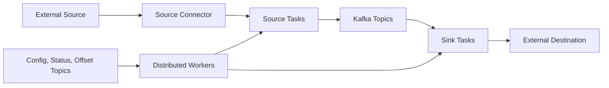

- Worker: connector와 task를 실행하는 process
- Connector: 외부 시스템 연결과 task 구성을 관리하는 제어 계층
- Task: 실제 record를 읽거나 쓰는 실행 단위
- Converter: Connect data와 Kafka byte payload 사이를 변환
- SMT: 단일 record에 가벼운 변환을 적용

Distributed mode에서는 여러 worker가 group을 이루고 task를 재분배한다. 설정, 상태, source offset을 Kafka 내부 topic에 저장한다.

Connect가 잘 맞는 경우는 검증된 JDBC, CDC, object storage, search connector로 표준 데이터 이동을 운영할 때다. 복잡한 업무 로직, 여러 stream join, 외부 API 호출 중심의 처리는 일반 애플리케이션이나 Kafka Streams가 더 적절할 수 있다.

## 9.5 Connect의 Exactly-once 범위

Source EOS는 지원 조건을 만족하는 connector가 Kafka record와 source offset을 하나의 Kafka transaction에 묶을 수 있게 한다. Distributed mode와 worker 설정이 필요하며, connector가 정확한 source offset과 재개 능력을 제공해야 한다.

Sink에서 `read_committed`를 사용한다고 외부 저장소까지 자동 EOS가 되는 것은 아니다. 대상 시스템의 upsert, idempotency, transaction과 offset 저장 방식을 connector가 어떻게 구현했는지 확인해야 한다.

## 9.6 외부 부수효과의 대사

완벽한 원자화가 불가능한 경계에서는 대사(reconciliation)가 필요하다.

- DB 업무 row와 발행 event 수 비교
- Outbox 미발행 row의 age와 개수
- Kafka topic의 event ID와 downstream 처리 이력 대조
- DLT와 재처리 결과 추적
- 외부 API idempotency key별 상태 조회

분산 시스템에서 복구 가능성은 "실패하지 않음"보다 "무엇이 누락되었는지 찾아 다시 처리할 수 있음"에 가깝다.

### 장 점검

- DB commit 뒤 Kafka send 전 process가 죽으면 어떤 문제가 생기는가?
- Outbox가 해결하는 문제와 해결하지 못하는 문제는 무엇인가?
- CDC source offset과 Kafka partition offset의 차이는 무엇인가?
- Connect sink가 `read_committed`라고 외부 DB EOS가 아닌 이유는 무엇인가?

---

# 10. Spring Kafka 기본 구현

## 10.1 추상화 이름을 원래 Kafka 개념에 연결한다

| Spring Kafka | Kafka 개념 |
|---|---|
| `KafkaTemplate` | Producer client를 감싼 발행 API |
| `ProducerFactory` | Producer 생성과 lifecycle 관리 |
| `@KafkaListener` | Consumer poll loop를 listener method로 연결 |
| Listener Container | Consumer thread, poll, commit, error handling 관리 |
| Container Factory | 여러 listener container의 공통 설정 |
| `Acknowledgment` | 수동 offset 처리 의사 표현 |
| `DefaultErrorHandler` | seek, retry, recovery 정책 |

Spring이 poll loop를 숨겨도 offset과 rebalance가 사라지는 것은 아니다. Container 설정을 이해하지 못하면 annotation 코드는 짧지만 실패 동작을 설명할 수 없다.

## 10.2 Producer 설정과 `KafkaTemplate`

```java
@Configuration
class KafkaProducerConfiguration {

    @Bean
    ProducerFactory<String, TrackCommand> producerFactory(KafkaProperties properties) {
        Map<String, Object> props = new HashMap<>(properties.buildProducerProperties());
        props.put(ProducerConfig.ACKS_CONFIG, "all");
        props.put(ProducerConfig.ENABLE_IDEMPOTENCE_CONFIG, true);
        props.put(ProducerConfig.MAX_IN_FLIGHT_REQUESTS_PER_CONNECTION, 5);
        return new DefaultKafkaProducerFactory<>(props);
    }

    @Bean
    KafkaTemplate<String, TrackCommand> kafkaTemplate(
            ProducerFactory<String, TrackCommand> producerFactory) {
        return new KafkaTemplate<>(producerFactory);
    }
}
```

발행 결과가 HTTP 계약에 중요하면 Future 완료를 제한된 timeout 안에서 확인해야 한다. 단순히 callback 로그만 남기고 이미 성공 응답을 보냈다면 사용자는 발행 실패를 알 수 없다.

```java
CompletableFuture<SendResult<String, TrackCommand>> publish(TrackCommand command) {
    return kafkaTemplate.send("track-commands", command.playlistUid(), command)
            .whenComplete((result, error) -> {
                if (error != null) {
                    log.error("publish failed commandId={}", command.commandId(), error);
                }
            });
}
```

## 10.3 `@KafkaListener`와 Concurrency

```java
@KafkaListener(
        topics = "track-commands",
        groupId = "playlist-writer-v1",
        concurrency = "3"
)
void consume(TrackCommand command) {
    playlistWriter.apply(command);
}
```

`concurrency=3`은 consumer thread를 세 개 만드는 설정이다. 파티션이 세 개라면 최대 세 thread가 각각 파티션을 맡을 수 있다. 파티션 하나인데 concurrency를 10으로 늘려도 일반 consumer group에서는 아홉 thread가 놀 수 있다.

애플리케이션 instance를 두 개 띄우면 전체 group member 수는 instance별 concurrency의 합이 된다. 용량 계획은 container 하나만 보지 않고 전체 배포 수를 본다.

## 10.4 Serializer와 Deserializer

JSON은 시작하기 쉽지만 type header, trusted package, 필드 호환, 알 수 없는 타입 처리까지 계약이 필요하다. 생산자와 소비자가 Java class 이름에 강하게 결합되지 않도록 명시적 type mapping이나 공용 schema를 고려한다.

역직렬화는 listener method 진입 전에 실패할 수 있다. Listener 안의 `try/catch`만으로 poison payload를 처리할 수 없다. 11장에서 `ErrorHandlingDeserializer`와 DLT를 연결한다.

## 10.5 AckMode의 실제 의미

Spring Container는 기본적으로 `enable.auto.commit=false`로 두며 기본 AckMode는 `BATCH`다.

| AckMode | 일반적인 commit 시점 |
|---|---|
| `RECORD` | record listener가 레코드 하나를 정상 반환한 뒤 |
| `BATCH` | 한 poll batch를 모두 정상 처리한 뒤 |
| `MANUAL` | `acknowledge()` 후 batch 경계에서 |
| `MANUAL_IMMEDIATE` | consumer listener thread에서 `acknowledge()`하면 즉시 commit 요청 |

`MANUAL`의 `acknowledge()`가 호출 즉시 broker commit을 뜻하지 않는다. `MANUAL_IMMEDIATE`도 다른 thread에서 ack하면 즉시성이 보장되지 않는다.

아래 listener가 의도대로 동작하려면 container의 AckMode를 먼저 `MANUAL`로 설정해야 한다. Spring Boot에서는 `spring.kafka.listener.ack-mode=manual`을 사용할 수 있다.

```java
@KafkaListener(topics = "track-commands", groupId = "playlist-writer-v1")
void consume(TrackCommand command, Acknowledgment acknowledgment) {
    playlistWriter.applyIdempotently(command);
    acknowledgment.acknowledge();
}
```

수동 ACK는 exactly-once 기능이 아니다. DB commit 뒤 ACK 전 죽으면 재전달된다. 업무 처리가 멱등해야 한다.

## 10.6 Listener에서 예외를 삼키지 않는다

```java
try {
    playlistWriter.apply(command);
} catch (Exception e) {
    log.error("failed", e);
    // return
}
```

이 코드는 프레임워크에 성공 반환으로 보일 수 있다. ErrorHandler와 transaction interceptor가 실패를 인지하려면 예외가 listener 밖으로 전파되어야 한다. 로그만 남기고 ACK를 호출하지 않았다는 이유만으로 원하는 재시도가 자동 보장되는 것은 아니다.

### 장 점검

- `@KafkaListener`가 숨긴 poll loop의 책임은 무엇인가?
- concurrency가 파티션 수보다 큰 경우 무슨 일이 생기는가?
- `MANUAL`과 `MANUAL_IMMEDIATE`의 차이를 설명할 수 있는가?
- listener에서 예외를 catch하고 return하면 ErrorHandler가 동작하는가?

---

# 11. Spring Kafka 신뢰성, 트랜잭션, 테스트

## 11.1 Blocking Retry와 DLT

`DefaultErrorHandler`는 listener 실패 뒤 record를 다시 전달하고, BackOff가 소진되면 recoverer에 넘길 수 있다.

```java
@Bean
DefaultErrorHandler errorHandler(KafkaTemplate<Object, Object> template) {
    DeadLetterPublishingRecoverer recoverer = new DeadLetterPublishingRecoverer(
            template,
            (record, error) ->
                    new TopicPartition(record.topic() + "-dlt", record.partition()));
    recoverer.setFailIfSendResultIsError(true);
    recoverer.setWaitForSendResultTimeout(Duration.ofSeconds(10));

    DefaultErrorHandler handler = new DefaultErrorHandler(
            recoverer,
            new FixedBackOff(1_000L, 2L));

    handler.addNotRetryableExceptions(ValidationException.class);
    return handler;
}
```

`FixedBackOff(1000, 2)`는 최초 처리 뒤 재시도 두 번, 총 세 번의 시도를 뜻한다. `DefaultErrorHandler`만 만들었다고 기본으로 DLT에 보내는 것이 아니다. `DeadLetterPublishingRecoverer`를 명시해야 한다.

Spring Boot 자동 구성 밖에서 직접 container factory를 만들었다면 `factory.setCommonErrorHandler(errorHandler)`로 이 handler를 연결해야 한다. DLT 발행까지 성공해야 원본 레코드를 복구된 것으로 볼지 정책을 정하고, 위 예시처럼 발행 실패를 예외로 돌려보내는 편이 안전하다.

기본적인 same-partition DLT 전략을 쓰면 DLT 토픽의 파티션 수가 원본 이상이어야 한다. DLT publish가 실패했을 때 offset을 진행할지, 다시 실패 record를 전달할지도 검증한다.

## 11.2 `ErrorHandlingDeserializer`

잘못된 JSON은 `poll()` 단계에서 역직렬화에 실패하므로 listener에 도달하지 못할 수 있다.

```java
props.put(ConsumerConfig.VALUE_DESERIALIZER_CLASS_CONFIG,
        ErrorHandlingDeserializer.class);
props.put(ErrorHandlingDeserializer.VALUE_DESERIALIZER_CLASS,
        JsonDeserializer.class.getName());
```

`ErrorHandlingDeserializer`는 원래 예외 정보를 header로 전달해 container error handling이 다룰 수 있게 한다. Batch listener는 null value와 exception header를 직접 검사해 실패 위치를 `BatchListenerFailedException`으로 알려야 한다. DLT에 정상 객체와 역직렬화에 실패한 원본 `byte[]`가 모두 전달될 수 있으므로 DLT용 `KafkaTemplate`의 serializer가 두 형태를 처리할 수 있어야 한다.

## 11.3 Non-blocking Retry

`@RetryableTopic`은 실패 record를 retry topic으로 발행하고 delay가 지난 뒤 별도 consumer가 처리한다. 원본 partition을 오래 막지 않는 장점이 있지만 record의 원래 순서를 잃는다.

```java
@RetryableTopic(
        kafkaTemplate = "kafkaTemplate",
        attempts = "4",
        backOff = @BackOff(delay = 1_000, multiplier = 2.0),
        dltTopicSuffix = "-dlt"
)
@KafkaListener(topics = "notification-commands", groupId = "notifier-v1")
void consume(NotificationCommand command) {
    notificationSender.send(command);
}
```

Non-blocking retry는 batch listener와 사용할 수 없고 container transaction과 결합할 수 없다. 순서가 중요한 command에는 blocking retry나 partition pause, 별도 보상 흐름을 검토한다.

## 11.4 Kafka Transaction과 Spring Container

Transaction-capable ProducerFactory와 `KafkaTransactionManager`를 container에 연결하면 listener 시작 전 Kafka transaction을 열 수 있다. Listener가 같은 transaction의 `KafkaTemplate`로 output을 보내고 정상 종료하면 output records와 input offsets가 함께 commit된다. 예외가 전파되면 둘 다 abort된다.

Spring Kafka 4.1은 EOS V2만 지원한다. `transactionIdPrefix`는 여러 애플리케이션 instance 사이에서 고유해야 이전 producer fencing을 잘못 일으키지 않는다.

Container transaction에서 listener가 예외를 던지면 transaction이 rollback되고 record가 다시 전달된다. 계속 실패하는 record를 일정 횟수 뒤 복구하거나 DLT로 보내려면 `DefaultAfterRollbackProcessor`를 구성한다. 복구 레코드와 그 offset까지 새 Kafka transaction에서 함께 commit하려면 processor의 `commitRecovered`와 transaction-capable `KafkaTemplate`을 함께 설정해야 한다.

DB transaction과 Kafka transaction을 함께 사용한다고 자동 2PC가 되는 것은 아니다. Commit 순서 중 두 번째가 실패할 수 있으며 보상 조치가 필요하다. Dual write를 근본적으로 피해야 한다면 Outbox를 우선 검토한다.

## 11.5 `asyncAcks`와 `nack`

`asyncAcks=true`는 한 poll batch 안에서 순서가 뒤섞인 acknowledge를 보류했다가 빈 offset이 채워졌을 때 commit한다. 그동안 consumer를 pause할 수 있고 장애 시 중복 가능성이 커진다. `nack()`와 함께 사용할 수 없다.

`nack()`는 consumer/listener thread에서 호출해야 한다. 비동기 worker thread로 record를 넘기고 나중에 마음대로 ACK/NACK하면 consumer의 thread confinement와 offset 순서를 깨뜨릴 수 있다.

## 11.6 테스트해야 할 실패

정상 발행과 정상 소비 한 번으로는 Kafka 신뢰성을 검증할 수 없다.

| 테스트 | 확인할 것 |
|---|---|
| Producer broker ACK 실패 | Future 실패와 API 응답 계약 |
| Consumer DB commit 뒤 process 종료 | 재전달과 DB 멱등성 |
| 역직렬화 실패 | listener 무한 정지 없이 DLT 격리 |
| Retry 소진 | 시도 횟수, backoff, DLT headers |
| DLT publish 실패 | 원 record offset 처리 정책 |
| Rebalance 중 처리 | revoke 시 offset과 중복 |
| Kafka transaction abort | `read_committed`에서 output 미노출 |
| 애플리케이션 재기동 | 동일 event의 중복 부수효과 없음 |

`spring-kafka-test`의 `EmbeddedKafkaKraftBroker`는 테스트용 KRaft broker를 시작한다. Consumer와 group ID는 테스트 애플리케이션이 별도로 만든다. 운영 버전, 보안, 네트워크 장애까지 재현하는 테스트는 Testcontainers나 별도 통합 환경이 필요하다.

### 장 점검

- `DefaultErrorHandler`가 기본으로 DLT에 보내는가?
- `@RetryableTopic`이 적합하지 않은 두 조건은 무엇인가?
- Kafka transaction과 DB transaction이 자동 2PC가 아닌 이유는 무엇인가?
- 정상 경로 외에 반드시 넣을 장애 테스트 세 가지를 고를 수 있는가?

---

# 12. 성능과 용량 산정

## 12.1 처리량 숫자보다 조건이 먼저다

"Kafka로 800 TPS를 처리했다"는 문장만으로는 성능을 평가할 수 없다. 다음 조건이 필요하다.

- Kafka와 client 버전
- broker 수, partition 수, RF, min ISR, `acks`
- payload 크기와 압축 가능성, key 분포
- producer batch, linger, compression
- consumer 수와 업무 처리 시간
- TLS 여부
- 테스트 시간, warm-up, arrival pattern
- p50, p95, p99 지연과 오류율
- 장애 중인지 정상 상태인지

처리량을 올렸는데 p99가 수십 초로 늘고 오류가 발생했다면 안정적으로 처리한 것이 아니다. 목표 SLO를 만족하는 구간을 찾아야 한다.

## 12.2 End-to-end 지연을 쪼갠다

진단용으로 지연을 다음 구간으로 나눌 수 있다.

```text
L_e2e ≈
  L_application_queue
  + L_producer_batch
  + L_broker_queue
  + L_leader_append
  + L_replication_ack
  + L_consumer_fetch
  + L_consumer_processing
```

실제 구간은 일부 겹치지만, 어떤 설정이 어느 시간을 바꾸는지 보는 데 유용하다. `linger.ms`는 producer batch 대기를, `acks=all`은 replication ACK를, `fetch.min.bytes`는 consumer fetch 대기를 늘릴 수 있다.

## 12.3 Partition 수 산정

측정한 단일 partition 지속 처리량을 이용한 출발식은 다음과 같다.

```text
P_required >= max(
  ceil(target_write_rate / measured_partition_rate),
  required_consumer_parallelism
)
```

여기서 `measured_partition_rate`는 같은 RF, ACK, 압축, record 크기, 보안 조건에서 측정해야 한다.

Key별 순서, hot key, partition 증가 뒤 key 재배치 허용 여부는 숫자 항이 아니라 이 계산 하한을 실제로 채택할 수 있는지 결정하는 별도 제약이다.

Partition은 많을수록 좋은 것이 아니다.

- 파일, segment, index, mmap 수가 늘어난다.
- leader election과 reassignment 비용이 늘어난다.
- consumer rebalance 대상이 늘어난다.
- 작은 partition이 많으면 batch 효율이 떨어질 수 있다.
- partition 수는 늘릴 수 있지만 줄이기 어렵다.
- 증가 뒤 key의 partition 매핑이 달라질 수 있다.

Consumer 병렬성만 보고 partition을 과도하게 만들지 말고, 목표 처리량과 장애 복구 시간을 함께 측정한다.

## 12.4 저장 용량

압축 후 실제 로그 유입 byte rate를 사용한다.

```text
S_cluster ≈ Σ(log_bytes_per_second × retention_seconds × replication_factor)
            + internal_topics
            + indexes_and_segments
            + compaction_or_retention_variation
            + operational_reserve
```

Broker 평균은 `S_cluster / broker_count`지만 leader와 replica 배치가 완전히 균등하다는 보장은 없다. Reassignment 중에는 기존 replica와 새 replica가 동시에 존재해 임시 공간이 더 필요하다.

Compacted topic은 단순히 유입률 × 시간으로 계산하기 어렵다. Key cardinality, 최신 value 크기, tombstone 수, cleaner 처리량을 측정한다.

## 12.5 네트워크와 복제 비용

논리 유입량이 `W`, RF가 `R`이면 follower 복제를 위해 대략 `W × (R - 1)`의 inter-broker 전송이 추가된다. 각 consumer group의 egress도 별도로 더해진다. 장애 복구와 reassignment 때는 정상 상태보다 네트워크와 디스크 부하가 높아진다.

실시간 유입을 받으면서 backlog를 목표 시간 안에 없애려면 다음 조건이 필요하다.

```text
recovery_processing_rate >= live_input_rate + backlog / recovery_window
```

Consumer 처리율이 유입률보다 작거나 같으면 lag는 영원히 줄지 않는다.

## 12.6 큰 Record의 설정 사슬

큰 record를 허용하려면 한 설정만 키워서는 안 된다.

| 계층 | 관련 설정 |
|---|---|
| Producer | `max.request.size` |
| Broker/Topic | `message.max.bytes`, `max.message.bytes` |
| Consumer | `fetch.max.bytes`, `max.partition.fetch.bytes` |
| Follower | `replica.fetch.max.bytes`, `replica.fetch.response.max.bytes` |

큰 payload는 memory pressure, 긴 GC, 네트워크 독점, batch 효율 저하를 만들 수 있다. Object storage pointer event가 더 나은지 먼저 검토한다.

## 12.7 벤치마크 원칙

1. 정상 목표 부하보다 낮은 구간부터 단계적으로 올린다.
2. Warm-up과 steady-state 결과를 분리한다.
3. 같은 payload와 key 분포를 사용한다.
4. 한 번에 한 변수만 바꾼다.
5. Producer 수치와 애플리케이션 end-to-end 수치를 구분한다.
6. 실패율과 p99를 평균과 함께 기록한다.
7. Broker 하나 중단, Consumer 재시작 같은 degraded 상태도 측정한다.
8. 실행 명령, 설정, 원시 결과를 저장소에 남긴다.

### 장 점검

- TPS 하나만으로 성능 개선을 증명할 수 없는 이유는 무엇인가?
- partition을 늘릴 때 좋아지는 것과 나빠지는 것을 각각 말할 수 있는가?
- 저장량 계산에 RF를 곱해야 하는 이유는 무엇인가?
- backlog가 계속 늘 때 consumer 수만 늘리기 전에 무엇을 확인해야 하는가?

---

# 13. 관측성, 운영, 장애 대응

## 13.1 관측은 세 층으로 나눈다

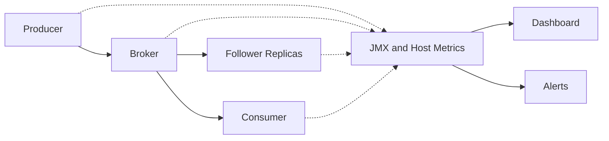

| 층 | 핵심 질문 | 신호 |
|---|---|---|
| 서비스 | 업무 처리가 제시간에 끝나는가? | E2E 지연, 처리율, consumer lag |
| 복제·가용성 | 데이터가 안전하고 읽고 쓸 수 있는가? | URP, under-min-ISR, offline partitions, ISR churn |
| 자원·요청 경로 | 병목이 어느 계층에 있는가? | request queue/time, handler idle, disk, network, client buffer |

Broker process가 살아 있다는 사실은 서비스가 정상이라는 뜻이 아니다.

## 13.2 가장 먼저 볼 Kafka 신호

| 신호 | 정상 기대 | 의미 |
|---|---:|---|
| `OfflinePartitionsCount` | `0` | leader가 없어 읽기·쓰기 불가인 partition 수 |
| `UnderReplicatedPartitions` | `0` | replica 중 ISR 밖에 있는 partition 수 |
| `UnderMinIsrPartitionCount` | `0` | min ISR보다 적어 쓰기 가용성이 위험한 partition 수 |
| `AtMinIsrPartitionCount` | 보통 `0` | 쓰기는 가능하지만 replica 여유가 없는 경계 |
| `UncleanLeaderElectionsPerSec` | `0` | 데이터 손실 가능성이 있는 leader 선출 |
| `IsrShrinksPerSec` | 안정 시 `0` | replica가 ISR에서 빠지는 속도 |
| `IsrExpandsPerSec` | 안정 시 `0` | replica가 다시 ISR에 들어오는 속도 |
| `OfflineLogDirectoryCount` | `0` | 사용할 수 없는 log directory |

URP와 offline partition은 같은 심각도가 아니다. URP는 복제 여유가 줄어든 상태일 수 있고, offline partition은 현재 서비스할 leader가 없는 상태다. Under-min-ISR은 `acks=all` 쓰기 실패와 직접 연결될 수 있다.

## 13.3 Request latency를 분해한다

Broker의 Produce/Fetch `TotalTimeMs`가 높아졌다고 디스크부터 의심하지 않는다.

- `RequestQueueTimeMs`: 처리 시작 전 queue 대기
- `LocalTimeMs`: broker local 처리
- `RemoteTimeMs`: follower 복제 등 원격 대기
- `ResponseQueueTimeMs`: 응답 queue 대기
- `ResponseSendTimeMs`: 응답 전송

Queue가 높으면 network/request handler 여유와 요청 폭증을 보고, local이 높으면 disk·CPU·message conversion을 보고, `acks=all` Produce의 remote가 높으면 ISR follower와 network를 본다.

## 13.4 Consumer Lag를 시간으로 바꾼다

운영 도구의 group lag는 보통 `LOG-END-OFFSET - committed offset`이다. Client의 `records-lag-max`는 현재 fetch position 기준일 수 있어 같은 값이 아니다.

레코드 수만 보면 payload와 처리 비용 차이를 알 수 없다. 다음처럼 회복 시간을 함께 본다.

```text
lag_recovery_seconds ≈ lag_records / (consumer_rate - producer_rate)
```

분모가 0 이하이면 현재 용량으로 회복할 수 없다. 특정 partition만 lag가 높다면 hot key, 느린 leader broker, 특정 payload, 외부 dependency를 확인한다.

## 13.5 Producer와 Consumer client 신호

Producer에서는 `record-error-rate`, `record-retry-rate`, `buffer-exhausted-rate`, `waiting-threads`, `request-latency`, `requests-in-flight`를 본다. Buffer가 마르면 애플리케이션 thread가 `max.block.ms`까지 기다릴 수 있다.

Consumer에서는 `records-consumed-rate`, `fetch-latency`, `commit-latency`, `last-poll-seconds-ago`, `time-between-poll-max`, `rebalance-rate-per-hour`, partition별 lag를 본다.

## 13.6 Rolling Restart

한 번에 한 broker만 내리고, 다음 broker로 가기 전 복제 상태가 회복됐음을 확인한다.

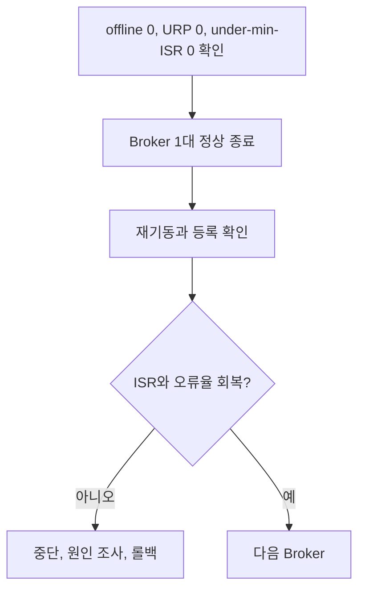

계획 작업 중 URP와 ISR 변화가 잠깐 생길 수 있지만 offline partition, unclean election, under-min-ISR은 가볍게 억제하면 안 된다.

## 13.7 Partition Reassignment

Broker 증설, 제거, 불균형 해소, RF 변경에는 reassignment를 사용한다. 이동 중에는 기존 traffic에 replica copy가 추가되므로 throttle과 진행률을 본다.

중단 기준은 다음과 같다.

- follower lag가 줄지 않는다.
- request queue와 p99가 계속 증가한다.
- URP가 회복되지 않는다.
- under-min-ISR 또는 offline partition이 발생한다.
- 디스크 여유가 안전선 아래로 떨어진다.

완료 뒤 verify를 수행하고 임시 throttle이 제거됐는지 확인한다.

## 13.8 장애 Runbook의 형태

좋은 경보는 "Kafka 이상"이 아니라 첫 행동을 포함한다.

**Consumer lag 급증**

1. Group 상태와 partition별 lag를 확인한다.
2. 유입률과 소비율을 비교한다.
3. Rebalance 반복과 poll 지연을 확인한다.
4. 한 partition만 밀리는지 본다.
5. 외부 DB/API 처리 시간을 확인한다.
6. Scale-out 전에 partition 수와 멱등성을 확인한다.

**URP 또는 ISR churn**

1. 영향 broker와 partition을 찾는다.
2. Disk latency, 용량, network, GC, handler idle을 확인한다.
3. 진행 중인 restart와 reassignment를 멈춘다.
4. Under-min-ISR이면 추가 broker 종료를 금지한다.
5. ISR 회복 뒤에만 변경을 재개한다.

### 장 점검

- URP, under-min-ISR, offline partition을 심각도별로 구분할 수 있는가?
- Consumer lag와 client `records-lag-max`가 항상 같은가?
- Produce latency가 높을 때 queue, local, remote를 어떻게 구분하는가?
- Rolling restart에서 다음 broker로 넘어가는 조건은 무엇인가?

---

# 14. 보안, 변경 관리, 재해 복구

## 14.1 보안은 세 층이다

- TLS: 전송 암호화와 선택적 client certificate 인증
- SASL: client 또는 broker 인증
- ACL: 인증된 주체가 어떤 resource에 어떤 작업을 할 수 있는지 인가

운영 환경에서 plaintext listener를 외부 네트워크에 노출하지 않는다. SASL/SCRAM을 사용한다면 TLS와 함께 사용해 credential 교환을 보호한다.

## 14.2 최소 권한

Producer에는 필요한 topic의 Write와 Describe, Consumer에는 topic Read와 group 권한을 준다. Transaction producer는 transactional ID 권한도 필요하다. Admin 권한을 애플리케이션에 주지 않는다.

KRaft에서는 `StandardAuthorizer`를 사용한다. ACL이 없는 resource를 모두 허용하는 설정은 운영 기본값으로 두지 않는다. Wildcard와 prefix ACL은 편하지만 예상보다 넓은 resource를 열 수 있다.

## 14.3 연결 한 번에 적용되는 보안 순서

Client 연결은 암호화, 인증, 인가 순서로 좁혀 볼 수 있다.

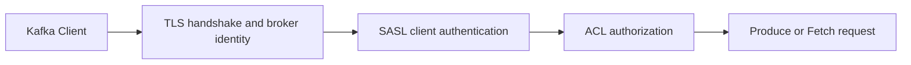

예를 들어 SCRAM client는 다음과 같은 연결 설정을 가진다. 실제 password와 truststore password는 secret manager나 배포 환경에서 주입한다.

```properties
security.protocol=SASL_SSL
sasl.mechanism=SCRAM-SHA-512
sasl.jaas.config=org.apache.kafka.common.security.scram.ScramLoginModule required \
  username="playlist-producer" password="${KAFKA_PASSWORD}";
ssl.truststore.location=/run/secrets/kafka.client.truststore.p12
ssl.truststore.type=PKCS12
ssl.endpoint.identification.algorithm=https
```

연결 실패를 한꺼번에 "Kafka 인증 오류"라고 부르지 않는다. TLS handshake 실패면 인증서 체인, hostname, 만료를 보고, SASL 실패면 mechanism과 credential을 본다. `TopicAuthorizationException`이나 `GroupAuthorizationException`이면 principal과 ACL resource pattern을 확인한다. 이 분리가 있어야 인증서를 바꾸다가 ACL을 잘못 고치는 식의 대응을 피할 수 있다.

## 14.4 Secret과 인증서

- Password를 repository와 compose에 평문 commit하지 않는다.
- Truststore, keystore의 접근 권한과 교체 절차를 관리한다.
- 인증서 만료를 경보한다.
- Broker는 inter-broker 연결에서 client와 server 역할을 모두 할 수 있다.
- Controller listener도 보안 경계에 포함한다.
- JMX remote endpoint도 인증과 network 접근 제어를 적용한다.

## 14.5 Quota와 폭주 격리

특정 producer나 consumer가 cluster 전체 자원을 독점하지 않도록 byte rate, request percentage 등의 quota를 검토한다. Quota throttle은 실패가 아니라 지연으로 나타날 수 있으므로 client throttle metric을 함께 본다.

## 14.6 Upgrade 원칙

1. Target 버전의 upgrade note와 제거 기능을 읽는다.
2. Client, broker, Connect, Streams, monitoring plugin 호환을 표로 만든다.
3. Metadata feature finalization과 downgrade 가능 시점을 확인한다.
4. Staging에서 rolling upgrade와 rollback을 실행한다.
5. 한 broker씩 변경하고 ISR 회복을 확인한다.
6. 최종화 전 충분한 관찰 기간을 둔다.

Kafka 4.x로 가기 전 ZooKeeper migration은 3.9 bridge release에서 끝내야 한다. KRaft dynamic quorum과 ELR 같은 feature는 "버전을 올렸으니 자동 활성"이라고 가정하지 않고 finalized feature level을 확인한다.

## 14.7 RPO와 RTO

- RPO: 장애 시 허용 가능한 데이터 손실 범위
- RTO: 서비스 복구까지 허용 가능한 시간

RF와 min ISR은 RPO에, broker spare capacity와 복구 bandwidth는 RTO에 영향을 준다. Multi-AZ replica 배치, rack awareness, backup과 재생 source, connector offset, schema registry, ACL과 config 백업까지 복구 계획에 포함한다.

Kafka replica는 실수로 삭제한 topic이나 잘못 publish한 데이터를 되돌리는 backup이 아니다. 잘못된 삭제는 모든 replica에 반영될 수 있다. 장기 보존, source 재수집, snapshot, object storage 등의 별도 복구 전략이 필요하다.

## 14.8 복구 계획을 시나리오로 검증한다

"다른 리전에 Kafka가 있다"만으로 재해 복구가 끝나지 않는다. 다음 시나리오를 문서와 훈련으로 검증한다.

1. Primary cluster 전체가 중단됐다고 선언할 기준과 권한자를 정한다.
2. Secondary cluster에 topic 설정, schema, ACL, transactional ID 정책이 준비되어 있는지 확인한다.
3. 복제 지연으로 잃을 수 있는 마지막 시각을 측정해 실제 RPO를 계산한다.
4. Producer bootstrap과 Consumer 연결을 전환하고, 중복 또는 빠진 업무 데이터를 대사한다.
5. Consumer Group offset을 동기화했다면 변환 규칙과 오차를 검증하고, 그렇지 않다면 업무 시각이나 key를 기준으로 재시작 위치를 정한다.
6. Primary 복구 뒤 양쪽에서 발생한 쓰기를 어떻게 합칠지 결정한 후 failback한다.

Active-active는 단순 DNS 전환보다 어렵다. 같은 key가 두 cluster에서 동시에 변경되면 Kafka의 partition 순서만으로 충돌을 해결할 수 없다. 업무 소유권, fencing, conflict resolution 규칙이 없다면 active-passive가 더 정직한 선택일 수 있다.

### 장 점검

- TLS, SASL, ACL의 책임을 구분할 수 있는가?
- Replica가 backup과 다른 이유는 무엇인가?
- Version upgrade에서 feature finalization을 서두르면 위험한 이유는 무엇인가?
- 자신의 시스템 RPO와 RTO를 숫자로 말할 수 있는가?

---

# 15. Kafka Streams와 확장 기능 선택

## 15.1 Kafka Streams

Kafka Streams는 Kafka topic을 입력과 출력으로 사용하는 stateful stream processing library다. 별도 cluster service가 아니라 애플리케이션에 포함해 실행한다.

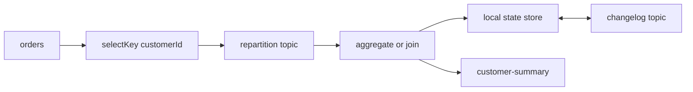

- Topology: source, processor, sink가 연결된 처리 그래프
- Task: input partition을 처리하는 실행 단위
- State Store: 집계와 join의 local 상태
- Changelog Topic: state store 복구를 위한 로그
- Repartition Topic: 새 key 기준으로 데이터를 다시 모으는 내부 topic

`selectKey` 뒤 group이나 join을 하면 repartition이 생길 수 있다. `Topology.describe()`로 내부 topic과 처리 단계를 확인한다.

`processing.guarantee=exactly_once_v2`는 input offset, output topic, state changelog를 Kafka transaction으로 원자화한다. 외부 DB와 API 부수효과는 포함하지 않는다.

Streams가 잘 맞는 경우는 window 집계, stream-table join, materialized view, Kafka 내부 stateful 처리다. 단순 DB-to-Kafka 이동은 Connect가 더 단순할 수 있다.

## 15.2 Event Time, Window, Grace

스트림의 시간은 처리 서버가 받은 시각만으로 정할 수 없다. 모바일 단말이나 외부 시스템에서 늦게 도착한 이벤트를 집계하려면 payload의 업무 발생 시각을 record timestamp로 해석하는 `TimestampExtractor`가 필요하다.

```java
KStream<String, OrderEvent> orders = builder.stream(
        "orders",
        Consumed.with(Serdes.String(), orderSerde)
                .withTimestampExtractor((record, partitionTime) ->
                        ((OrderEvent) record.value()).occurredAt().toEpochMilli()));

orders.selectKey((key, order) -> order.customerId())
        .groupByKey(Grouped.with(Serdes.String(), orderSerde))
        .windowedBy(TimeWindows.ofSizeAndGrace(
                Duration.ofMinutes(5),
                Duration.ofMinutes(1)))
        .count(Materialized.as("orders-per-customer-5m"));
```

위 집계는 5분 window가 끝난 뒤 1분 동안 늦은 record를 더 받는다. Grace까지 지난 레코드는 해당 window 결과를 다시 바꾸지 못한다. Grace를 크게 잡으면 정확성 여유는 늘지만 state 보존과 결과 확정 시간이 길어진다. 결과를 언제 외부에 내보낼지도 update마다 보낼지, window가 닫힐 때까지 suppress할지 결정해야 한다.

Stream time은 애플리케이션이 관찰한 partition timestamp에 따라 전진한다. 입력이 멈춘 partition, 미래 시각으로 잘못 찍힌 event, partition별 유입 편차가 window 결과와 지연에 영향을 줄 수 있으므로 timestamp 품질 자체를 metric으로 관리한다.

## 15.3 Join과 State 복구

Join은 양쪽 레코드가 있다는 사실만으로 성공하지 않는다.

- KStream-KStream join은 같은 key와 지정한 시간 window 안의 레코드를 연결한다.
- KStream-KTable join은 stream record가 처리되는 순간의 table 상태를 조회하며, 나중에 table이 바뀐다고 과거 stream record를 자동 재결합하지 않는다.
- Key가 다르면 repartition이 필요하고, null key는 key 기반 연산에서 제외될 수 있다.

Stateful 연산의 local state store는 빠른 조회를 제공하지만 원본은 아니다. Task가 다른 instance로 이동하면 changelog topic으로 state를 복원한다. 큰 store는 복구 시간과 local disk 사용량을 늘리고, 그동안 처리 지연이 생긴다. `num.standby.replicas`는 다른 instance에 standby state를 유지해 failover 복구 시간을 줄일 수 있지만 disk와 network 복제 비용이 추가된다.

`application.id`는 Consumer Group 이름이면서 internal repartition·changelog topic의 namespace다. 이를 바꾸면 기존 offset과 state를 이어받지 않는 새 애플리케이션처럼 동작할 수 있다. Topology 변경 전에는 `Topology.describe()`, internal topic, state store 호환성, reset 또는 migration 절차를 함께 검토한다.

## 15.4 Tiered Storage

Tiered Storage는 최근 hot segment를 broker local disk에 두고 오래된 closed segment를 remote storage로 옮겨 긴 retention의 local disk 비용을 줄이는 기능이다.

Kafka 4.3.1은 운영용 S3/HDFS RemoteStorageManager 구현을 내장하지 않으므로 별도 plugin이 필요하다. Broker subsystem과 topic별 remote storage 설정은 모두 기본 비활성이다.

현재 compacted topic은 지원하지 않는다. Remote read는 cold path latency와 egress 비용이 있으므로 "디스크가 싸진다"만 보고 켜지 않는다. Audit, 드문 replay, 장기 backfill에는 유리하지만 모든 과거 데이터를 자주 읽는 workload에는 부적합할 수 있다.

## 15.5 선택표

| 문제 | 우선 검토 |
|---|---|
| 애플리케이션이 직접 event를 발행·소비 | Producer/Consumer |
| 표준 DB·SaaS·object storage 연계 | Kafka Connect |
| Window, join, 집계, stateful stream | Kafka Streams |
| Partition 수보다 많은 작업 worker | Share Groups |
| 긴 retention과 드문 과거 replay | Tiered Storage |
| DB와 event 발행의 dual write | Outbox + CDC/Relay |
| 외부 부수효과 중복 방지 | Idempotency + 처리 이력/보상 |

새 기능을 선택할 때는 코드량만 줄어드는지, 별도 내부 topic·state·connector·plugin을 운영해야 하는지도 함께 본다.

### 장 점검

- Connect와 Streams의 차이를 데이터 이동과 처리 관점에서 설명할 수 있는가?
- Streams EOS가 외부 DB까지 포함하지 않는 이유는 무엇인가?
- Tiered Storage가 compacted topic에 맞지 않는 이유는 현재 제품 제약과 어떤 관계인가?
- Share Groups를 선택하면 포기하는 순서 성질은 무엇인가?

---

# 16. Plys 실제 구현 해부와 개선 설계

이 장은 일반적인 모범 사례를 Plys가 이미 구현한 것처럼 쓰지 않는다. 현재 저장소에서 확인되는 구성, 실제 요청 흐름, 한계, 개선 순서로 나눈다.

검증 기준은 저장소 commit `56aa9d0`과 현재 작업 트리다. 독자는 동반 저장소 없이도 흐름을 이해할 수 있도록 필요한 설정과 코드 동작을 본문에서 함께 설명하며, 파일 경로는 원문을 다시 확인하기 위한 근거로 제공한다.

Plys의 topic 이름과 Java class 이름에는 `track-added`, `track-removed`, `TrackEvent`가 들어가지만, record가 발행되는 시점에는 DB 추가·삭제가 아직 일어나지 않았다. 이 레코드는 발생한 사실을 알리는 event보다 DB 변경을 요청하는 command에 가깝다. 이 장에서는 현재 이름은 그대로 인용하되 의미를 설명할 때는 command라고 부른다.

## 16.1 저장소 Compose에 선언된 클러스터 구성

| 항목 | Compose 선언값 |
|---|---|
| Kafka image | `apache/kafka:3.8.1` |
| 노드 | 3개 |
| 모드 | 각 노드가 `broker,controller`인 KRaft Combined |
| Data listener | Docker 내부 `PLAINTEXT:9092` |
| Controller listener | `9093` |
| 기본 RF | `3` |
| `min.insync.replicas` | `2` |
| Offsets topic RF | `3` |
| Transaction state RF / min ISR | `3 / 2` |
| Retention | `168`시간 |
| 인증·암호화 | 내부 PLAINTEXT, SASL/TLS 없음 |

개발과 운영 compose 모두 세 노드 구성이지만 combined mode는 broker와 controller 장애 영역을 공유한다. 작은 팀 프로젝트에서는 단순한 선택이지만, 이것만으로 고가용성이 검증됐다고 말할 수는 없다. 실제 topic describe, ISR, 장애 주입 결과가 함께 있어야 한다.

관련 파일:

- `infra/docker-compose.kafka.yml`
- `infra/docker-compose.kafka.dev.yml`
- `infra/.env.example`

## 16.2 Topic과 Producer

Plys는 이름은 event 형태지만 실제 용도는 command에 가까운 두 topic을 선언한다.

- `plys.playlist.track-added`
- `plys.playlist.track-removed`

각 topic은 partition 3, RF 3으로 코드에 선언되어 있다. 실제 cluster 생성 결과는 실행 환경에서 `kafka-topics.sh --describe`로 확인해야 한다.

Producer는 두 command 모두 `playlistUid`를 key로 사용한다. 같은 topic 안에서 같은 플레이리스트의 요청을 같은 partition으로 보내려는 선택이다.

```properties
spring.kafka.producer.acks=all
spring.kafka.producer.retries=3
spring.kafka.producer.properties.enable.idempotence=true
spring.kafka.producer.properties.max.in.flight.requests.per.connection=5
```

이 조합은 broker 전송 재시도의 중복을 억제하는 방향이다. 그러나 추가와 삭제가 서로 다른 topic이므로 두 동작의 교차 순서는 보장하지 않는다. Producer idempotence도 Consumer의 중복 DB insert를 막지 않는다.

관련 파일:

- `src/main/java/com/pjt/plys/common/config/KafkaConfig.java`
- `src/main/java/com/pjt/plys/common/kafka/TrackEventProducer.java`
- `src/main/resources/application.properties`

## 16.3 수동 추천 폼에서 곡을 추가하는 실제 흐름

```mermaid
sequenceDiagram
    participant U as User
    participant F as Frontend
    participant A as Playlist API
    participant P as KafkaTemplate
    participant K as Kafka
    participant C as Track Consumer
    participant M as MySQL Primary

    U->>F: 곡 추가
    F->>A: POST add track
    A->>P: send with playlistUid key
    P-->>A: Future returned
    A-->>F: Future 완료를 기다리지 않고 HTTP 201
    F->>F: 임시 항목을 즉시 표시
    P->>K: async produce
    K->>C: deliver command record
    C->>M: track, video, mapping transaction
    F->>A: 1초 뒤 playlist detail GET
    A->>M: detail query forces Primary
    A-->>F: current persisted list
    F->>F: GET 성공 시 서버 목록으로 교체하고 cache
```

핵심은 세 가지다.

1. `KafkaTemplate.send()` Future를 기다리지 않고 HTTP `201`을 반환하므로, 응답 시점에 broker ACK와 DB 반영 완료가 보장되지 않는다.
2. 수동 추천 폼은 임시 ID로 곡을 즉시 표시한 뒤 1초 후 상세 목록으로 덮어쓴다.
3. Playlist 상세 조회는 쿼리 전에 Primary 강제 context를 설정한다.

성공한 CUD 응답은 frontend의 GET cache 전체를 비우므로, 수동 추천 폼에서 곡 추가가 성공한 뒤 1초 후 실행되는 상세 조회는 새 요청이다. 그 시점에 Consumer가 아직 DB commit하지 않았거나 Producer·Consumer가 실패했다면 Primary를 읽어도 곡은 없다. 50곡 제한에 걸리면 Consumer는 mapping을 저장하지 않고 ACK한 뒤 끝낸다. 반대로 CUD 요청 자체가 실패하면 cache가 비워지지 않은 상태에서 `finally`의 재조회가 실행되어 기존 GET cache를 볼 수 있다. 성공한 GET 결과는 이후 30초 동안 cache될 수 있다. 따라서 이 경로에서 곡이 보이지 않는 현상을 MySQL replica lag 하나로 설명하면 틀린다.

AI 추천곡 추가는 별도 경로다. 이 코드는 POST 응답의 `playlistMappingId`로 화면 항목을 만들려고 하지만 1초 재조회를 예약하지 않는다. 현재 backend 응답 객체에는 message만 채워지고 mapping ID는 채워지지 않으므로, 이 경로는 수동 추천 폼의 낙관적 표시·재조회 흐름과 같다고 설명할 수 없다. API가 비동기 command를 받는 계약을 유지한다면 임시 command ID와 상태 조회를 제공하거나, 두 frontend 경로가 동일한 reconciliation 전략을 사용하도록 맞춰야 한다.

## 16.4 Consumer 설정과 실제 병렬성

```properties
spring.kafka.consumer.group-id=plys-consumer-group
spring.kafka.consumer.auto-offset-reset=earliest
spring.kafka.consumer.enable-auto-commit=false
spring.kafka.listener.ack-mode=manual
```

두 listener는 같은 group 이름을 사용하지만 서로 다른 topic을 구독한다. Listener에 concurrency를 지정하지 않았으므로 단일 JVM에서 각 listener container의 기본 concurrency는 1이다. Partition이 3개라는 사실만으로 한 JVM이 세 partition을 병렬 처리하지 않는다.

50곡 미만의 정상 추가 경로에서 Consumer는 다음 순서로 DB를 처리한다.

```text
Playlist 조회
-> 50곡 제한 확인
-> Track 조회 또는 생성
-> Video 조회 또는 생성
-> PlaylistMapping 저장
-> acknowledge
```

DB 메서드에는 `@Transactional`이 있지만 Kafka offset과 DB commit은 하나의 원자적 transaction이 아니다. DB commit 뒤 offset commit 전에 죽으면 같은 record가 다시 올 수 있다.

## 16.5 가장 위험한 현재 동작: 예외를 삼킨다

Consumer는 예외를 catch해 로그를 남기고 다시 던지지 않는다. 이 때문에 container의 ErrorHandler가 실패를 받지 못한다. "ACK를 호출하지 않았으니 자동 재시도된다"고 단정할 수 없다.

현재 저장소에는 다음이 없다.

- `DefaultErrorHandler`의 명시적 BackOff
- DLT
- Consumer DB 멱등성 처리 이력
- Consumer 장애와 재처리 통합 테스트

개선의 첫 단계는 예외를 프레임워크에 전달하고, 재시도 가능 오류와 영구 오류를 분류하는 것이다.

```java
@KafkaListener(topics = TRACK_COMMAND_TOPIC, groupId = "playlist-writer-v2")
void addTrack(TrackCommand command) {
    playlistWriter.applyIdempotently(command); // 예외를 숨기지 않는다.
}
```

그다음 `eventId` 또는 command ID의 unique 처리 이력을 같은 DB transaction에 넣고, ErrorHandler와 DLT를 구성한다.

현재 흐름의 핵심 문제는 Kafka input과 MySQL 변경 사이의 원자성이다. `KafkaTransactionManager`는 Kafka에서 읽고 다시 Kafka로 쓰는 흐름의 record와 offset을 묶는 데 유용하지만, 추가하는 것만으로 MySQL transaction까지 원자적으로 묶이지 않는다. Plys에는 먼저 DB 멱등성과 실패 복구 정책이 필요하다.

## 16.6 `MasterReadContext`의 실제 범위

`MasterReadContext`는 `ThreadLocal<Long>`에 2초 만료 시각을 둔다. ThreadLocal은 다음 HTTP 요청이나 Kafka Consumer thread로 자동 전달되지 않는다.

```mermaid
flowchart LR
    H1["HTTP Thread A POST"] --> T1["ThreadLocal A"]
    C["Kafka Consumer Thread"] --> TC["ThreadLocal Consumer"]
    H2["HTTP Thread B GET"] --> T2["ThreadLocal B"]
```

Consumer의 `markWriteOccurred()`는 사용자 GET 요청의 thread에 영향을 주지 않는다. 삭제 DELETE 요청 thread의 mark도 다음 GET thread로 이어지지 않는다. 반대로 현재 playlist detail method는 자기 GET thread에서 직접 Primary를 강제하므로 그 조회는 Primary를 본다.

`clear()` 호출처가 없다는 점도 주의해야 한다. Thread pool이 같은 thread를 다른 요청에 재사용하면 만료 전 의도하지 않은 요청이 Primary로 갈 수 있다. Request filter나 `try/finally`로 context 생명주기를 정리해야 한다.

## 16.7 추가와 삭제를 다른 Topic으로 나눈 결과

같은 `playlistUid`를 key로 사용해도 topic이 다르면 다음 순서를 보장하지 못한다.

```text
add topic:    Add X ---------> Consumer A
remove topic: Remove X -> Consumer B
```

Remove가 먼저 DB를 조회해 대상이 없다고 판단한 뒤 Add가 commit될 수 있다. 추가와 삭제의 상대 순서가 업무상 중요하다면 하나의 command topic으로 합치고 event type으로 구분하거나, aggregate version을 검증하는 설계를 고려한다.

## 16.8 두 가지 정합성 모델 중 하나를 선택한다

### 모델 A: 동기 DB 변경 후 이벤트 발행

사용자가 곡 추가 성공을 받는 순간 DB에 데이터가 있어야 한다면, API transaction에서 DB를 먼저 변경한다. 이후 이벤트는 Outbox로 발행한다.

```text
POST -> DB business row + outbox commit -> 201
CDC/Relay -> Kafka TrackAdded fact
```

장점은 API 의미가 명확하고 read-after-write가 쉽다는 점이다. Kafka는 후속 알림·통계·검색 반영에 사용한다.

### 모델 B: 비동기 Command 수락

쓰기 부하 완충이 핵심이라면 API는 `202 Accepted`와 command ID를 반환한다.

```text
POST -> Kafka AddTrack command accepted -> 202 + commandId
Consumer -> DB apply -> command status SUCCEEDED or FAILED
Frontend -> pending 표시, status 확인 또는 push 수신
```

이 모델은 실패 상태와 최종 결과 조회 API가 필요하다. `201 Created`와 실제 resource ID를 반환하지 못하는 현재 의미보다 더 정직하다.

Plys는 두 모델 사이에 있다. HTTP는 생성 성공처럼 `201`을 반환하지만 실제 DB 생성은 나중에 이루어진다. 먼저 API 의미를 하나로 정해야 한다.

## 16.9 성능 수치의 증거 수준

저장소에는 현재 k6 script, 원시 결과, dashboard export, 실험 조건 문서가 없다. `120 TPS -> 800 TPS`는 기존 미추적 문서의 한 문장 외에 재현 근거가 확인되지 않는다.

따라서 기술 문서에서는 다음처럼 구분한다.

- **확인된 사실**: Kafka 비동기 쓰기, MySQL 읽기 분리, Nginx/Tomcat/HikariCP 관련 설정이 존재한다.
- **사용자 보유 결과일 수 있으나 저장소 미확인**: 120 TPS에서 800 TPS 개선, 읽기·쓰기 평균 지연 감소.
- **금지할 인과**: "Kafka 하나로 120에서 800 TPS가 되었다."

현재 작업 트리에서 Kafka, DB 읽기 분리, connection pool, web server 설정이 함께 존재한다는 사실만 확인된다. 어떤 설정이 비교 실험 사이에 실제로 바뀌었고 결과에 얼마나 기여했는지는 검증되지 않았다. 테스트 시나리오까지 달랐다면 두 수치의 직접 비교 자체가 성립하지 않을 수 있다. 다음에는 script, test duration, VU/rate model, p95/p99, 오류율, 변경 전후 commit hash를 저장소에 남겨 인과를 검증해야 한다.

## 16.10 Plys 개선 우선순위

| 우선순위 | 개선 | 이유 |
|---:|---|---|
| 1 | API를 동기 생성 또는 비동기 command 중 하나로 명확화 | 사용자 성공 의미를 바로잡는다. |
| 2 | Consumer 예외 재전파와 ErrorHandler/DLT | 실패를 숨기지 않는다. |
| 3 | `eventId`와 DB 멱등성 | 재전달 시 중복 mapping을 막는다. |
| 4 | 추가·삭제 순서 계약 재설계 | 다른 topic 간 race를 막는다. |
| 5 | Master context lifecycle 정리 | ThreadLocal 누수와 잘못된 routing을 막는다. |
| 6 | Producer Future 실패와 command 상태 관측 | 발행 실패를 사용자와 운영자가 알 수 있게 한다. |
| 7 | Kafka 통합·장애 테스트 | ACK, rebalance, 재기동, 중복을 검증한다. |
| 8 | 부하 테스트 원시 자료 저장 | 성능 주장을 재현 가능하게 한다. |

### Plys를 60초로 설명하기

> Plys는 곡 추가와 삭제 요청을 Kafka command로 넘겨 HTTP request thread와 DB 작업 시점을 분리했다. 저장소 Compose에는 세 노드 KRaft cluster, RF 3, min ISR 2가 선언되어 있고, Producer는 `acks=all`, idempotence와 `playlistUid` key를 사용한다. 다만 추가 API는 Producer Future 완료와 DB commit을 기다리지 않고 201을, 삭제 API는 같은 완료를 기다리지 않고 200을 반환한다. Consumer 예외 처리와 DB 멱등성, 서로 다른 add/remove topic의 순서, frontend별 reconciliation 차이가 보완 과제다. 곡이 바로 보이지 않는 현상도 현재 상세 조회는 Primary를 사용하므로 replica lag 하나가 아니라 Consumer 반영 시점과 frontend 재조회·cache를 함께 봐야 한다.

---

# 17. 실습 문제와 해설

## 17.1 안전 수칙과 환경

모든 실습은 로컬 Docker Desktop과 별도 학습용 cluster에서만 실행한다. `docker stop`, topic 삭제, volume 삭제를 운영 cluster에서 실행하면 안 된다.

필요한 도구는 Windows PowerShell, Git, Docker Desktop의 Linux container engine이다. 17.6 Java 실습에는 JDK 17 이상과 Gradle 또는 Maven, 17.7에는 Spring Boot와 Spring Kafka를 실행할 수 있는 작은 테스트 프로젝트가 추가로 필요하다. Host port `29092`, `39092`, `49092`가 비어 있는지도 확인한다.

```powershell
docker info | Out-Null
if ($LASTEXITCODE) { throw "Docker Desktop Linux 엔진을 시작하세요." }

docker pull apache/kafka:4.3.1

if (-not (Test-Path "kafka-4.3.1-lab")) {
  git clone --depth 1 --branch 4.3.1 https://github.com/apache/kafka.git kafka-4.3.1-lab
}
Set-Location kafka-4.3.1-lab

$env:IMAGE = "apache/kafka:4.3.1"
$ComposeFile = "docker/examples/docker-compose-files/cluster/combined/plaintext/docker-compose.yml"
$Project = "kafka-book-431"
$Broker = "kafka-1"
$K = "/opt/kafka/bin"
$BS = "kafka-1:19092,kafka-2:19092,kafka-3:19092"
$HostBS = "localhost:29092,localhost:39092,localhost:49092"
$TopicSuffix = [guid]::NewGuid().ToString("N").Substring(0, 8)

foreach ($name in @("kafka-1", "kafka-2", "kafka-3")) {
  $owner = docker inspect --format '{{ index .Config.Labels "com.docker.compose.project" }}' $name 2>$null
  if ($LASTEXITCODE -eq 0 -and $owner -ne $Project) {
    throw "다른 작업의 container $name 이 이미 존재합니다. 이름 충돌을 먼저 해결하세요."
  }
}

docker compose -p $Project -f $ComposeFile up -d

for ($i = 0; $i -lt 30; $i++) {
  docker exec $Broker "$K/kafka-broker-api-versions.sh" --bootstrap-server $BS *> $null
  if ($LASTEXITCODE -eq 0) { break }
  Start-Sleep -Seconds 2
}
if ($LASTEXITCODE -ne 0) { throw "Kafka cluster가 60초 안에 준비되지 않았습니다." }

docker compose -p $Project -f $ComposeFile ps
```

세 노드 복제 실습은 Apache Kafka `4.3.1` source의 공식 combined plaintext compose를 사용한다. 위 변수는 같은 PowerShell 창에서 뒤 실습이 공유한다. 공식 예제는 broker log를 container 내부 `/tmp/kraft-combined-logs`에 두고 별도 volume을 연결하지 않는다. 잠시 멈출 때는 `docker compose -p $Project -f $ComposeFile stop`을 사용한다. `down`으로 container를 제거하면 학습 데이터도 사라진다.

## 17.2 실습 1: Key와 Partition

**목표**: 같은 key가 같은 partition으로 가고 순서가 partition 내부에서만 유지되는지 확인한다.

```powershell
$KeyTopic = "key-demo-$TopicSuffix"

docker exec kafka-1 "$K/kafka-topics.sh" --bootstrap-server $BS `
  --create --topic $KeyTopic --partitions 3 --replication-factor 3

@("user-1:A", "user-2:B", "user-1:C", "user-1:E") |
  docker exec -i kafka-1 "$K/kafka-console-producer.sh" `
  --bootstrap-server $BS --topic $KeyTopic `
  --reader-property parse.key=true --reader-property key.separator=:

docker exec kafka-1 "$K/kafka-console-consumer.sh" `
  --bootstrap-server $BS --topic $KeyTopic --from-beginning --max-messages 4 `
  --property print.key=true `
  --property print.partition=true `
  --property print.offset=true
```

**관찰**: 출력 전체는 partition 사이에서 섞일 수 있지만 `user-1`의 값은 같은 partition에서 `A`, `C`, `E` 순서로 나타난다. Partition 번호 자체는 중요한 정답이 아니다.

**문제**: Partition을 6개로 늘린 뒤에도 `user-1`이 반드시 기존 partition에 가는가?  
**정답**: 아니다. 기본 hash 결과를 partition 수로 나누는 매핑이 달라질 수 있다.

## 17.3 실습 2: Retention과 Compaction

```powershell
$RetentionTopic = "retention-demo-$TopicSuffix"
$CompactTopic = "compact-demo-$TopicSuffix"

docker exec kafka-1 "$K/kafka-topics.sh" --bootstrap-server $BS --create `
  --topic $RetentionTopic --partitions 1 --replication-factor 3 `
  --config cleanup.policy=delete --config retention.ms=10000 `
  --config segment.ms=5000 --config file.delete.delay.ms=1000

@("old-1", "old-2") | docker exec -i kafka-1 "$K/kafka-console-producer.sh" `
  --bootstrap-server $BS --topic $RetentionTopic
Start-Sleep -Seconds 6
"new-segment" | docker exec -i kafka-1 "$K/kafka-console-producer.sh" `
  --bootstrap-server $BS --topic $RetentionTopic

docker exec kafka-1 "$K/kafka-topics.sh" --bootstrap-server $BS --create `
  --topic $CompactTopic --partitions 1 --replication-factor 3 `
  --config cleanup.policy=compact --config segment.ms=5000 `
  --config min.cleanable.dirty.ratio=0.01 --config min.compaction.lag.ms=0

@("a:v1", "a:v2", "b:v1") | docker exec -i kafka-1 "$K/kafka-console-producer.sh" `
  --bootstrap-server $BS --topic $CompactTopic `
  --reader-property parse.key=true --reader-property key.separator=:
Start-Sleep -Seconds 6
"roll:x" | docker exec -i kafka-1 "$K/kafka-console-producer.sh" `
  --bootstrap-server $BS --topic $CompactTopic `
  --reader-property parse.key=true --reader-property key.separator=:
```

Retention은 record의 나이가 아니라 닫힌 segment 단위로 삭제된다. 기본 `log.retention.check.interval.ms`가 길 수 있으므로 10초가 지났다고 바로 삭제되지 않는다. 30초 간격으로 최대 6분 동안 `--from-beginning` 결과를 다시 확인한다. Compaction도 비동기다. 같은 방식으로 반복 조회하면 cleaner가 처리하기 전에는 `a:v1`, `a:v2`가 함께 보이고, 처리 뒤에는 오래된 `a:v1`이 사라질 수 있다. Active segment는 두 정책 모두 즉시 정리 대상이 아니다.

**문제**: `compact` topic에 key별 record가 항상 하나만 존재하는가?  
**정답**: 아니다. Compaction 전에는 여러 버전이 보일 수 있고, cleaner가 처리한 뒤에도 최신 값과 tombstone 정책에 따라 달라진다.

## 17.4 실습 3: RF와 min ISR

```powershell
$RfTopic = "rf-demo-$TopicSuffix"

docker exec kafka-1 "$K/kafka-topics.sh" --bootstrap-server $BS --create `
  --topic $RfTopic --partitions 1 --replication-factor 3 `
  --config min.insync.replicas=2

$Description = docker exec kafka-1 "$K/kafka-topics.sh" `
  --bootstrap-server $BS --describe --topic $RfTopic
$Description
$LeaderMatch = [regex]::Match(($Description -join "`n"), 'Leader:\s+(\d+)')
if (-not $LeaderMatch.Success) { throw "Leader broker를 찾지 못했습니다." }
$LeaderId = [int]$LeaderMatch.Groups[1].Value
$LeaderContainer = "kafka-$LeaderId"
$AdminContainer = @("kafka-1", "kafka-2", "kafka-3") |
  Where-Object { $_ -ne $LeaderContainer } | Select-Object -First 1

docker compose -p $Project -f $ComposeFile stop $LeaderContainer

$StateAfterStop = $null
for ($i = 0; $i -lt 30; $i++) {
  $raw = docker exec $AdminContainer "$K/kafka-topics.sh" `
    --bootstrap-server $BS --describe --topic $RfTopic 2>$null
  $leader = [regex]::Match(($raw -join "`n"), 'Leader:\s+(\d+)')
  $isr = [regex]::Match(($raw -join "`n"), 'Isr:\s+([0-9,]+)')
  if ($leader.Success -and $isr.Success) {
    $isrCount = ($isr.Groups[1].Value -split ',').Count
    if ([int]$leader.Groups[1].Value -ne $LeaderId -and $isrCount -eq 2) {
      $StateAfterStop = $raw
      break
    }
  }
  Start-Sleep -Seconds 2
}
if ($null -eq $StateAfterStop) { throw "Leader 재선출과 ISR 2 상태를 확인하지 못했습니다." }
$StateAfterStop

"two-isr-write" | docker exec -i $AdminContainer "$K/kafka-console-producer.sh" `
  --bootstrap-server $BS --topic $RfTopic `
  --sync `
  --producer-property acks=all `
  --producer-property delivery.timeout.ms=10000 `
  --producer-property request.timeout.ms=5000

docker exec $AdminContainer "$K/kafka-configs.sh" --bootstrap-server $BS `
  --alter --entity-type topics --entity-name $RfTopic `
  --add-config min.insync.replicas=3

"must-fail" | docker exec -i $AdminContainer "$K/kafka-console-producer.sh" `
  --bootstrap-server $BS --topic $RfTopic `
  --sync `
  --producer-property acks=all `
  --producer-property delivery.timeout.ms=10000 `
  --producer-property request.timeout.ms=5000
if ($LASTEXITCODE -eq 0) { throw "min ISR 3인데 write가 성공했습니다. 상태를 다시 확인하세요." }
```

ISR이 2일 때 min ISR 2의 `acks=all` write는 성공할 수 있다. 같은 장애 상태에서 min ISR을 3으로 올리면 `NotEnoughReplicas` 계열 오류로 실패해야 한다.

**문제**: RF 3이면 broker 한 대가 죽어도 언제나 write가 가능한가?  
**정답**: 아니다. 살아 있는 ISR 수, min ISR, leader 선출, producer ACK 조건에 달렸다.

**복구**:

```powershell
docker compose -p $Project -f $ComposeFile start $LeaderContainer
docker exec kafka-1 "$K/kafka-configs.sh" --bootstrap-server $BS `
  --alter --entity-type topics --entity-name $RfTopic `
  --add-config min.insync.replicas=2

$Recovered = $false
for ($i = 0; $i -lt 30; $i++) {
  $raw = docker exec kafka-1 "$K/kafka-topics.sh" `
    --bootstrap-server $BS --describe --topic $RfTopic 2>$null
  $isr = [regex]::Match(($raw -join "`n"), 'Isr:\s+([0-9,]+)')
  if ($isr.Success -and ($isr.Groups[1].Value -split ',').Count -eq 3) {
    $Recovered = $true
    $raw
    break
  }
  Start-Sleep -Seconds 2
}
if (-not $Recovered) { throw "ISR이 3으로 복구되지 않았습니다." }
```

ISR이 3으로 돌아오지 않았다면 다음 실습으로 넘어가기 전에 원인을 확인한다.

## 17.5 실습 4: Consumer Lag와 Rebalance

```powershell
$LagTopic = "lag-demo-$TopicSuffix"
$Group = "lag-group-$TopicSuffix"

docker exec kafka-1 "$K/kafka-topics.sh" --bootstrap-server $BS --create `
  --topic $LagTopic --partitions 6 --replication-factor 3

1..10000 | docker exec -i kafka-1 "$K/kafka-console-producer.sh" `
  --bootstrap-server $BS --topic $LagTopic

docker exec kafka-1 "$K/kafka-console-consumer.sh" --bootstrap-server $BS `
  --topic $LagTopic --group $Group --from-beginning --max-messages 1 *> $null
docker exec kafka-1 "$K/kafka-consumer-groups.sh" --bootstrap-server $BS `
  --group $Group --topic $LagTopic --reset-offsets --to-earliest --execute
docker exec kafka-1 "$K/kafka-consumer-groups.sh" --bootstrap-server $BS `
  --describe --group $Group

$C1 = Start-Process -FilePath "docker" -WindowStyle Hidden -PassThru `
  -ArgumentList @("exec", "kafka-1", "$K/kafka-console-consumer.sh",
    "--bootstrap-server", $BS, "--topic", $LagTopic, "--group", $Group,
    "--from-beginning")
Start-Sleep -Seconds 3
docker exec kafka-1 "$K/kafka-consumer-groups.sh" --bootstrap-server $BS `
  --describe --group $Group --members --verbose

$C2 = Start-Process -FilePath "docker" -WindowStyle Hidden -PassThru `
  -ArgumentList @("exec", "kafka-2", "$K/kafka-console-consumer.sh",
    "--bootstrap-server", $BS, "--topic", $LagTopic, "--group", $Group,
    "--from-beginning")
Start-Sleep -Seconds 3
docker exec kafka-1 "$K/kafka-consumer-groups.sh" --bootstrap-server $BS `
  --describe --group $Group --members --verbose
docker exec kafka-1 "$K/kafka-consumer-groups.sh" --bootstrap-server $BS `
  --describe --group $Group
```

첫 번째 `--describe`에서는 earliest로 되돌린 offset 뒤의 lag를 확인한다. Consumer를 하나에서 둘로 늘리면 member별 partition assignment가 바뀐다. 로컬에서는 10,000건이 빠르게 소진되어 lag가 곧 0이 될 수 있지만, member와 assignment 변화는 소비가 끝난 뒤에도 확인할 수 있다. 실습이 끝나면 `@($C1, $C2) | ForEach-Object { Stop-Process -Id $_.Id -Force -ErrorAction SilentlyContinue }`로 두 client를 종료한다.

Classic protocol이 Kafka 4.3.1 Java consumer의 기본이다. 새 consumer protocol을 시험하려면 `group.protocol=consumer`를 명시하고 server-side group 설정 차이를 확인한다.

**문제**: Consumer를 partition 수보다 많이 띄우면 처리량이 계속 증가하는가?  
**정답**: 일반 group에서는 초과 consumer가 idle이므로 증가하지 않는다.

## 17.6 실습 5: Transaction Visibility

이 실습은 다음 최소 Gradle 프로젝트로 실행한다.

```groovy
// build.gradle
plugins {
    id 'application'
}

repositories {
    mavenCentral()
}

dependencies {
    implementation 'org.apache.kafka:kafka-clients:4.3.1'
}

application {
    mainClass = 'TransactionVisibilityLab'
}
```

```java
// src/main/java/TransactionVisibilityLab.java
import java.util.Properties;
import java.util.UUID;
import org.apache.kafka.clients.producer.KafkaProducer;
import org.apache.kafka.clients.producer.ProducerConfig;
import org.apache.kafka.clients.producer.ProducerRecord;
import org.apache.kafka.common.serialization.StringSerializer;

public class TransactionVisibilityLab {
    public static void main(String[] args) throws Exception {
        if (args.length != 2) {
            throw new IllegalArgumentException("usage: <bootstrapServers> <topic>");
        }

        Properties txProps = baseProperties(args[0]);
        txProps.put(ProducerConfig.TRANSACTIONAL_ID_CONFIG,
                "tx-lab-" + UUID.randomUUID());

        try (KafkaProducer<String, String> producer = new KafkaProducer<>(txProps)) {
            producer.initTransactions();

            producer.beginTransaction();
            producer.send(new ProducerRecord<>(args[1], "k", "committed")).get();
            producer.commitTransaction();

            producer.beginTransaction();
            producer.send(new ProducerRecord<>(args[1], "k", "aborted")).get();
            producer.abortTransaction();
        }

        try (KafkaProducer<String, String> producer =
                     new KafkaProducer<>(baseProperties(args[0]))) {
            producer.send(new ProducerRecord<>(
                    args[1], "k", "non-transactional")).get();
        }
    }

    private static Properties baseProperties(String bootstrapServers) {
        Properties props = new Properties();
        props.put(ProducerConfig.BOOTSTRAP_SERVERS_CONFIG, bootstrapServers);
        props.put(ProducerConfig.KEY_SERIALIZER_CLASS_CONFIG, StringSerializer.class);
        props.put(ProducerConfig.VALUE_SERIALIZER_CLASS_CONFIG, StringSerializer.class);
        return props;
    }
}
```

먼저 원래 실습 PowerShell에서 topic을 만든다.

```powershell
$TxTopic = "tx-demo-$TopicSuffix"
docker exec kafka-1 "$K/kafka-topics.sh" --bootstrap-server $BS --create `
  --topic $TxTopic --partitions 1 --replication-factor 3
"gradle run --args=`"$HostBS $TxTopic`""
```

마지막 줄에 출력된 명령을 위 Gradle 프로젝트 디렉터리에서 실행한다. `gradle` 명령이 없다면 설치된 Gradle로 한 번 `gradle wrapper`를 실행한 뒤 `gradle` 대신 `.\gradlew.bat`을 사용한다. 프로그램 종료 뒤 원래 실습 창에서 두 consumer를 비교한다.

```powershell
docker exec kafka-1 "$K/kafka-console-consumer.sh" --bootstrap-server $BS `
  --topic $TxTopic --from-beginning --max-messages 3 `
  --consumer-property isolation.level=read_uncommitted

docker exec kafka-1 "$K/kafka-console-consumer.sh" --bootstrap-server $BS `
  --topic $TxTopic --from-beginning --max-messages 2 `
  --consumer-property isolation.level=read_committed
```

**관찰**: `read_uncommitted`는 commit·abort 여부와 관계없이 세 레코드를 볼 수 있다. `read_committed`는 abort된 레코드를 건너뛰지만, commit된 transactional 레코드뿐 아니라 non-transactional 레코드도 읽는다. 아직 끝나지 않은 transaction이 있으면 LSO 뒤의 레코드는 transaction이 끝날 때까지 보류될 수 있다.

**문제**: 이 transaction 안에서 실행한 MySQL insert도 함께 abort되는가?  
**정답**: 아니다. Kafka transaction 범위 밖이다.

## 17.7 실습 6: Spring DLT

11.1절의 `DefaultErrorHandler`를 String listener에 연결하고 원본과 같은 partition 수의 DLT를 만든다.

```powershell
$DltSource = "dlt-source-$TopicSuffix"
$DltTopic = "$DltSource-dlt"

docker exec kafka-1 "$K/kafka-topics.sh" --bootstrap-server $BS --create `
  --topic $DltSource --partitions 3 --replication-factor 3
docker exec kafka-1 "$K/kafka-topics.sh" --bootstrap-server $BS --create `
  --topic $DltTopic --partitions 3 --replication-factor 3
```

Spring 실습 프로젝트에는 다음 설정을 둔다. `lab.topic`은 PowerShell 변수와 자동으로 연결되지 않으므로 애플리케이션 실행 인자로 명시한다.

```properties
spring.kafka.bootstrap-servers=localhost:29092,localhost:39092,localhost:49092
spring.kafka.consumer.auto-offset-reset=earliest
spring.kafka.consumer.key-deserializer=org.apache.kafka.common.serialization.StringDeserializer
spring.kafka.consumer.value-deserializer=org.apache.kafka.common.serialization.StringDeserializer
spring.kafka.producer.key-serializer=org.apache.kafka.common.serialization.StringSerializer
spring.kafka.producer.value-serializer=org.apache.kafka.common.serialization.StringSerializer
```

```java
@Bean
ConcurrentKafkaListenerContainerFactory<String, String> kafkaListenerContainerFactory(
        ConsumerFactory<String, String> consumerFactory,
        DefaultErrorHandler errorHandler) {
    var factory = new ConcurrentKafkaListenerContainerFactory<String, String>();
    factory.setConsumerFactory(consumerFactory);
    factory.setCommonErrorHandler(errorHandler);
    return factory;
}

@KafkaListener(topics = "${lab.topic}", groupId = "dlt-lab")
void consume(String value) {
    if (value.startsWith("invalid-fatal")) {
        throw new ValidationException("invalid payload");
    }
    if (value.startsWith("invalid-retry")) {
        throw new IllegalStateException("temporary failure for retry lab");
    }
}
```

11.1절의 handler는 `ValidationException`을 not-retryable로 분류한다. 따라서 `invalid-fatal`은 첫 실패 뒤 바로 recoverer로 가고, 기본 retry 대상인 `IllegalStateException`은 `FixedBackOff(1_000, 2)`에 따라 총 세 번 호출된 뒤 DLT로 이동한다. 첫 실습 창에서 실행 명령을 출력한다.

```powershell
".\gradlew.bat bootRun --args=`"--lab.topic=$DltSource`""
```

출력된 명령에는 이번 실습의 실제 topic 이름이 들어 있다. 그 명령을 Spring 프로젝트가 있는 다른 PowerShell 창에서 실행한다. 애플리케이션이 준비된 뒤 원래 실습 창에서 두 레코드를 발행한다.

```powershell
@("invalid-retry-1", "invalid-fatal-1") |
  docker exec -i kafka-1 "$K/kafka-console-producer.sh" `
  --bootstrap-server $BS --topic $DltSource

docker exec kafka-1 "$K/kafka-console-consumer.sh" --bootstrap-server $BS `
  --topic $DltTopic --from-beginning --max-messages 2 `
  --property print.key=true --property print.headers=true `
  --property print.partition=true --property print.offset=true
```

확인 항목:

- 총 시도 횟수
- 원본 topic, partition, offset header
- 예외 class와 message
- DLT publish 실패 시 동작
- DLT 재처리 뒤 중복 부수효과

## 17.8 실습 7: 성능 측정 기록지

| 항목 | 값 |
|---|---|
| Kafka/client 버전 | |
| Broker/partition/RF/min ISR | |
| ACK/idempotence/compression | |
| Record 크기/key 분포 | |
| VU 또는 arrival rate | |
| Test/warm-up 시간 | |
| records/s, bytes/s | |
| p50/p95/p99/p99.9 | |
| 오류율과 오류 종류 | |
| Consumer lag와 회복 시간 | |
| 장애 조건 | |
| 실행 command와 commit hash | |

같은 표가 없으면 두 결과를 공정하게 비교하기 어렵다.

## 17.9 실습 환경 정리

모든 실습을 마친 뒤 이번 Compose project만 제거한다. 공식 예제는 별도 volume이 없으므로 container와 함께 실습 데이터도 사라진다.

```powershell
@($C1, $C2) | Where-Object { $null -ne $_ } | ForEach-Object {
  Stop-Process -Id $_.Id -Force -ErrorAction SilentlyContinue
}
docker compose -p $Project -f $ComposeFile down
```

## 17.10 종합 문제

**문제 1**: `acks=all`, RF 3, min ISR 2에서 ISR이 2라면 몇 replica가 ACK해야 성공하는가?  
**정답**: 현재 ISR 전체인 2개다. Min ISR은 최소 write 허용선이다.

**문제 2**: Consumer가 DB commit 뒤 죽고 offset을 commit하지 못했다. 어떤 보장이며 어떻게 방어하는가?  
**정답**: At-least-once 재전달이 가능하다. Event ID unique 처리나 업무 unique key로 DB 처리를 멱등하게 만든다.

**문제 3**: Retry topic으로 보내면 원래 partition 순서가 유지되는가?  
**정답**: 보통 아니다. 실패 record가 별도 topic과 consumer를 거치는 동안 뒤 record가 먼저 처리될 수 있다.

**문제 4**: Plys에서 playlist 상세 조회가 Primary를 보는데 곡이 안 보였다. 우선 볼 것은?  
**정답**: Producer Future, Consumer lag와 예외, DB commit 시각, 50곡 제한, 1초 재조회와 frontend 30초 cache를 확인한다. Replica lag로 바로 결론 내리지 않는다.

---

# 18. 부록: 설정 결정표, 면접 질문, 참고 자료

## 18.1 결정 중심 설정표

### Producer

| 목표 | 우선 확인 | 함께 볼 위험 |
|---|---|---|
| 유실 위험 감소 | `acks=all`, idempotence, RF/min ISR | 장애 시 write 가용성 |
| 순서 유지 | key, partition, idempotence, max in-flight | hot key와 topic 간 순서 |
| 처리량 증가 | batch, linger, compression | p99 지연과 buffer memory |
| 실패 시간 제한 | delivery timeout, request timeout | HTTP timeout과 뒤늦은 기록 |

### Consumer

| 목표 | 우선 확인 | 함께 볼 위험 |
|---|---|---|
| 중복 허용 처리 | 처리 후 commit, DB 멱등성 | 재처리 비용 |
| 낮은 lag | partition, consumer 수, 처리 시간 | rebalance와 외부 dependency |
| 긴 처리 | max poll interval, poll size, pause | timeout을 무작정 늘리는 문제 |
| 실패 격리 | ErrorHandler, BackOff, DLT | 순서와 DLT 운영 |

### Broker/Topic

| 목표 | 우선 확인 | 함께 볼 위험 |
|---|---|---|
| 내구성 | RF, min ISR, unclean election | write 가용성 |
| 보존 | retention, segment | disk와 복구 시간 |
| 최신 상태 | compaction, tombstone | cleaner 지연과 null key |
| 장기 보존 | Tiered Storage plugin | cold read, 비용, compact 제약 |

## 18.2 면접 질문과 짧은 답

**Kafka가 빠른 이유는?**  
Partition log의 순차 append, producer/consumer batch, OS page cache, 복사를 줄이는 전송 경로가 결합되기 때문이다. 단순히 메모리에만 저장해서가 아니다.

**`acks=all`이면 절대 유실이 없는가?**  
아니다. 현재 ISR 전체 ACK와 min ISR 조건을 사용하지만 운영 설정, unclean election, disk와 cluster 장애, producer가 ACK 전에 죽는 경계까지 모든 손실을 없애지는 않는다.

**Partition을 늘리면 무조건 빨라지는가?**  
병렬성 상한은 늘지만 파일·metadata·rebalance 비용이 늘고 key mapping이 바뀌며 hot key는 해결되지 않을 수 있다.

**수동 ACK면 exactly-once인가?**  
아니다. DB commit 뒤 ACK 전 장애 시 재전달된다. 멱등한 Consumer가 필요하다.

**Kafka transaction이 DB까지 묶는가?**  
아니다. Kafka output과 input offset의 원자성을 제공한다. DB에는 Outbox, 멱등성, 보상 설계가 필요하다.

**Consumer lag가 높으면 Consumer만 늘리면 되는가?**  
아니다. Partition 수, hot key, 처리 시간, 외부 dependency, rebalance, broker fetch 지연을 먼저 분리한다.

**Plys에서 Kafka의 역할은?**  
HTTP request thread와 곡 DB 작업 시점을 분리하고 순간 write 요청을 log로 완충하는 역할이다. 현재는 API 성공 의미, Consumer 실패 복구, DB 멱등성, add/remove 순서가 개선 과제다.

## 18.3 용어 사전

| 용어 | 한 문장 정의 |
|---|---|
| Broker | Kafka server process가 실행되는 node |
| Topic | record를 분류하는 논리적 namespace |
| Partition | 순서와 병렬 처리의 단위인 append-only log |
| Offset | partition 안 record의 위치 |
| Leader | 해당 partition의 일반 produce/fetch를 담당하는 replica |
| Follower | Leader log를 fetch해 복제하는 replica |
| ISR | Leader를 충분히 따라가는 replica 집합 |
| HW | 일반 consumer에게 공개할 수 있는 commit 경계 |
| LEO | Replica log 끝의 다음 offset |
| Consumer Group | partition 작업을 나누고 독립 offset을 갖는 소비 단위 |
| Rebalance | Group member와 partition assignment를 재조정하는 과정 |
| Tombstone | Compacted topic에서 key 삭제를 나타내는 null value record |
| KRaft | Kafka metadata를 Raft log로 합의하는 control plane |
| DLT | 반복 또는 영구 실패 record를 운영자가 다루도록 격리하는 topic |

## 18.4 공식 참고 자료

- [Apache Kafka 4.3 Documentation](https://kafka.apache.org/43/documentation/)
- [Apache Kafka 4.3 Design](https://kafka.apache.org/43/design/design/)
- [Apache Kafka 4.3 Producer Configs](https://kafka.apache.org/43/generated/producer_config.html)
- [Apache Kafka 4.3 Consumer Configs](https://kafka.apache.org/43/generated/consumer_config.html)
- [Apache Kafka 4.3 KRaft Operations](https://kafka.apache.org/43/operations/kraft/)
- [Apache Kafka 4.3 Monitoring](https://kafka.apache.org/43/operations/monitoring/)
- [Apache Kafka 4.3 Security](https://kafka.apache.org/43/security/security-overview/)
- [Apache Kafka 4.3 Tiered Storage](https://kafka.apache.org/43/operations/tiered-storage/)
- [Spring for Apache Kafka Reference](https://docs.spring.io/spring-kafka/reference/)
- [KIP-500: Replace ZooKeeper with a Self-Managed Metadata Quorum](https://cwiki.apache.org/confluence/display/KAFKA/KIP-500%3A+Replace+ZooKeeper+with+a+Self-Managed+Metadata+Quorum)
- [KIP-848: The Next Generation of the Consumer Rebalance Protocol](https://cwiki.apache.org/confluence/display/KAFKA/KIP-848%3A+The+Next+Generation+of+the+Consumer+Rebalance+Protocol)
- [KIP-932: Queues for Kafka](https://cwiki.apache.org/confluence/display/KAFKA/KIP-932%3A+Queues+for+Kafka)
- [KIP-966: Eligible Leader Replicas](https://cwiki.apache.org/confluence/display/KAFKA/KIP-966%3A+Eligible+Leader+Replicas)

## 18.5 마지막 확인표

책을 끝까지 읽은 뒤 다음 항목을 그림 없이 설명할 수 있어야 한다.

- [ ] Kafka와 queue, DB, REST의 역할 차이
- [ ] Topic, partition, segment, offset의 관계
- [ ] Key가 순서와 병렬성에 미치는 영향
- [ ] Retention과 compaction의 차이
- [ ] RF, ISR, HW, LEO, leader epoch
- [ ] `acks=all`과 min ISR의 정확한 관계
- [ ] Producer batch, retry, timeout, idempotence
- [ ] Consumer poll, commit, rebalance, lag
- [ ] At-least-once와 idempotent consumer
- [ ] Kafka transaction의 보장 경계
- [ ] Outbox와 CDC가 해결하는 dual write
- [ ] Spring AckMode, ErrorHandler, DLT
- [ ] Partition와 저장 용량 산정
- [ ] URP, under-min-ISR, offline partition 대응
- [ ] TLS, SASL, ACL의 역할
- [ ] Plys 현재 구조의 장점과 사실 기반 한계

Kafka를 마스터한다는 것은 설정값을 많이 외우는 일이 아니다. 어떤 성공을 보장하려 했고, 그 대가로 무엇을 포기했으며, 장애가 발생했을 때 어디까지 복구할 수 있는지를 코드와 지표로 설명하는 일이다.
