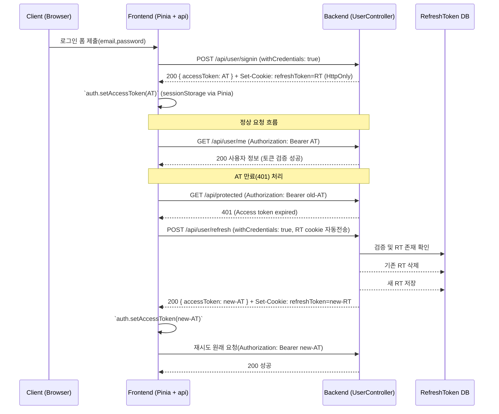

# @RequestBody, @RequestParam, @ResponseBody

- **@RequestBody** → 바디(JSON 등) 통째로 객체로 매핑
- **@RequestParam** → URL 쿼리 파라미터 or ?뒤에 오는 값
- **@ResponseBody** → 리턴값을 그대로 JSON 등으로 응답(요즘은 생략 가능)

---

## @RequestBody — “요청 바디(JSON)” 가져오기

클라이언트가 아래처럼 **JSON 바디**를 보내면:

```json
{
  "name": "동훈",
  "age": 26
}
```

컨트롤러에서 받는 법:

```java
@PostMapping("/user")
public User saveUser(@RequestBody User user) {
    return user;
}
```

✔ JSON → User 객체로 자동 변환  
✔ 주로 POST, PUT 같은 **바디 있는 요청**에서 사용

---

## @RequestParam — “URL 쿼리 파라미터” 받는 것

예:  
`GET /search?keyword=apple&page=2`

```java
@GetMapping("/search")
public String search(@RequestParam String keyword,
                     @RequestParam(defaultValue="1") int page) {
    return keyword + " / " + page;
}
```

✔ URL에 붙는 값 받아옴  
✔ ? 뒤에 오는 값, form-data도 됨  
✔ 기본 타입(String, int 등) 받기 좋아

---

## @ResponseBody — “리턴값을 JSON으로 응답”

```java
@GetMapping("/hello")
@ResponseBody
public String hello() {
    return "hi";
}
```

✔ 리턴값을 뷰(View)로 보내지 말고 **그대로 응답 본문에 쓰라는 의미**

📌 **주의:**  
`@RestController` 쓰면 **자동으로 @ResponseBody 포함됨**  
그래서 요즘은 거의 안 씀.

```java
@RestController
public class UserController {
    @GetMapping("/hi")
    public String hi() {
        return "hello";
    }
}
```


## 📌 Jackson(JSON 파싱) 기준에서의 핵심

### 요청(@RequestBody) 받을 때 → **setter가 있어야 함**
- 역직렬화
- JSON → 객체로 만들 때 값 넣어야 하니까
### 응답(@ResponseBody) 보낼 때 → **getter만 있어도 됨**
- 직렬화
- 객체 → JSON 변환은 getter만 보고 함

---


# `Jackson` 은 어떻게 동작하는가?

`Spring`**3.0** 이후로 **컨트롤러**의 리턴 방식이 `@RequestBody` 형식이라면,  `Spring`은 `MessageConverter` **API** 를 통해, **컨트롤러**가 리턴하는 객체를 후킹 할 수 있습니다.

`Jackson`은 `JSON`데이터를 출력하기 위한  `MappingJacksonHttpMessageConverter`를 제공합니다. 만약 우리가 스프링 **MessageConverter**를 위의 `MappingJacksonHttpMessageConverter`으로 등록한다면, **컨트롤러**가 리턴하는 객체를 다시 뜯어(**_자바 리플렉션 사용_**), `Jackson`의 **ObjectMapper** **API**로 `JSON 객체`를 만들고 난 후, 출력하여 `JSON`데이터를 완성합니다.

더욱 편리해진 점은, `Spring` **3.1** 이후로 만약 클래스패스에 `Jackson` 라이브러리가 존재한다면, ( 쉽게 말해**_Jackson을 설치했느냐 안했느냐_** ) 자동적으로 **MessageConverter**가 등록된다는 점입니다.

덕분에 우리는 아래와 같이 매우 편리하게 사용할 수 있습니다.
```java
@RequestMapping("/json")  
@ResponseBody()  
public Object printJSON() {  
    Person person = new Person("Mommoo", "Developer");  
    return person;  
}
```

> 출처
> https://mommoo.tistory.com/83


---


# ResponseEntity

➡ **HTTP 응답 전체를 네가 직접 구성해서 반환하는 객체**
HTTP 응답은 3가지 요소로 이루어짐:
1. **Status Code** (예: 200, 400, 404, 500)
2. **Headers**
3. **Body(JSON)**

일반적으로는 `return UserDto` 이런 식으로 바디만 반환했는데,  
ResponseEntity는 이걸
-  상태코드  
- 헤더  
 - 바디

## 왜 쓰냐?

예를 들어 아래 상황들:
- 성공이면 `201 Created` 보내고 싶음
- 실패하면 `400 Bad Request` 보내고 싶음
- Location 같은 헤더 추가하고 싶음
- JSON 말고 파일 반환하고 싶음
- 비즈니스 로직에 따라 응답 코드를 명확하게 나누고 싶음

이때 `return dto;` 만으로는 부족하니까 쓰는 거임.

---
## 기본 예시 (가장 흔함)

```java
@GetMapping("/hello")
public ResponseEntity<String> hello() {
    return ResponseEntity.ok("안녕");
}
```

응답:
```
HTTP/1.1 200 OK
Content-Type: text/plain
Body: 안녕
```

---
## JSON 반환도 이렇게

```java
@GetMapping("/user")
public ResponseEntity<Map<String, Object>> getUser() {
    Map<String, Object> result = new HashMap<>();
    result.put("name", "동훈");
    result.put("age", 26);
    
    return ResponseEntity.ok(result);
}
```
- Map을 넣었으니 자동으로 JSON 직렬화됨  (by Jackson)
- 상태코드는 200

---
## 상태코드 바꾸기

예: 회원가입 성공 → 201 Created

```java
@PostMapping("/user")
public ResponseEntity<User> createUser(@RequestBody User user) {
    return ResponseEntity.status(201).body(user);
}
```

---
## 상태코드 + 헤더 + 바디 모두 커스텀

```java
return ResponseEntity
        .status(HttpStatus.CREATED)
        .header("X-User-Id", "123")
        .body(new UserResponse("홍길동"));
```

---

## 자주 쓰는 정적 메서드

| 코드                    | 사용      |
| --------------------- | ------- |
| `ok(body)`            | 200 응답  |
| `badRequest().body()` | 400 응답  |
| `notFound().build()`  | 404 응답  |
| `noContent().build()` | 204 응답  |
| `status(code).body()` | 임의 상태코드 |

예:

```java
return ResponseEntity.badRequest().body("입력값이 잘못됨");
```

---

## 결국 ResponseEntity는?

**"스프링이 응답을 만들 때 상태코드/헤더/바디를 다 네가 직접 구성하게 하는 박스"**


```java
@PostMapping("/signin")
public ResponseEntity<?> signin(@RequestBody SigninRequest request) {
    // ↑ 반환 타입              ↑ 요청 받기
    //   (보낼 때)                 (받을 때)
}
```

### SigninRequest는 어떻게 받는가?

### Vue에서 보내는 JSON
```javascript
axios.post('/api/user/signin', {
  email: 'test@test.com',
  password: '1234'
})
```

### 실제 HTTP 요청
````http
POST /api/user/signin HTTP/1.1
Content-Type: application/json

{"email":"test@test.com","password":"1234"}
```

### Spring Boot의 Jackson이 변환
```
JSON 문자열                          SigninRequest 클래스
┌──────────────────────────┐        ┌───────────────────────────┐
│ {                        │        │ public class              │
│   "email": "test@...",   │   →    │   SigninRequest {         │
│   "password": "1234"     │        │   private String email;   │
│ }                        │        │   private String password;|
└──────────────────────────┘        │ }                         │
                                    └───────────────────────────┘

                                     SigninRequest 객체
                                     ┌─────────────────────────┐
                                     │ email = "test@test.com" │
                                     │ password = "1234"       │
                                     └─────────────────────────┘
````

---

# 언제 재빌드 하면 되나?

## 재빌드(이미지/아티팩트 새로 만드는 것) **필요한 경우**

- **Java 코드 변경 (.java)**  
    → `mvn package`(또는 Gradle 빌드)로 .jar/.class 만든 뒤 이미지를 새로 빌드해야 변경 반영.  
    _단, 개발용으로 소스 폴더를 컨테이너에 바인드 마운트하고 `mvn spring-boot:run` 또는 devtools로 실행하면 이미지 재빌드 없이도 반영 가능._
- **리소스 파일 변경(프로덕션에 패키징된 .xml, .properties)**  
    → 이 파일들이 JAR 안에 패키징돼 있다면 **재빌드 + 이미지 재생성** 필요.  
    _대신 로컬 파일을 컨테이너에 마운트하면 컨테이너 재시작만으로 반영 가능._
- **의존성 추가/변경 (pom.xml / build.gradle)**  
    → 빌드 결과물이 바뀌니 **무조건 재빌드 필요**(jar 재생성 + 이미지 재빌드).
- **Dockerfile 변경 / 베이스 이미지 변경**  
    → 이미지 구성 자체가 바뀌므로 **이미지 재빌드 필요**.
- **프런트엔드(프로덕션) 빌드 변경 (vite 빌드 설정 등)**  
    → `npm run build` 하여 정적파일을 만들고 그걸 이미지에 포함한다면 **재빌드 필요**.

---

## 재빌드 불필요한 경우 (재시작 / 재생성만으로 OK)

- **환경변수 변경 (.env 파일)**  
    → 이미지 재빌드 불필요. 컨테이너 재시작(또는 재생성)이면 반영됨.  
    `docker-compose up -d`(변경된 env로 재생성 필요 시 `docker-compose up -d --force-recreate`) 또는 `docker-compose restart <service>`.
- **docker-compose.yml에서 포트/볼륨 매핑 변경**  
    → 이미지 재빌드 불필요. 단, compose 변경은 컨테이너 재생성 필요.  
    `docker-compose up -d` 하거나 `docker-compose up -d --force-recreate` 하면 된다.
- **컨테이너 실행 옵션(포트, 볼륨, env) 변경**  
    → 재생성/재시작만으로 해결.
- **단순 설정값(로그 레벨 등)을 컨테이너 시작 커맨드로 주입**  
    → 재빌드 X, restart 또는 재생성.

---
아래는 참고사항?
## 도커 위에서 Spring / Vite / MySQL 개발할 때 실무 팁

1. **개발용은 ‘마운트 & 런’**
    - 백엔드: 소스(`src`)와 `target/classes`를 컨테이너에 바인드해서 `mvn spring-boot:run` 실행. 코드 바꾸면 자동 재시작(또는 devtools로 빠른 재시작). → 이미지 재빌드 불필요.
    - 프론트엔드(vite): `npm run dev`를 컨테이너나 호스트에서 실행하고 소스 마운트. Vite의 HMR(Hot Module Replacement)로 변경 즉시 반영. → 이미지 재빌드 불필요.
2. **프로덕션 이미지는 정적파일을 포함해서 빌드**
    - 프론트도 `npm run build` 해서 정적 자원을 이미지에 복사하면, 정적파일 변경시 이미지 재빌드 필요.
3. **MySQL은 데이터가 볼륨에 있으니 스키마 변경은 마이그레이션 필요**
    - DB 스키마 변경은 이미지 빌드와 별개로 마이그레이션(Run migration, Flyway 등) 필요. 재빌드는 필요없음.
4. **빠른 개발 워크플로(예)**
    - `docker-compose up --build` : 이미지가 바뀔 때(의존성 변경, Dockerfile 변경) 사용
    - `docker-compose up -d` : 이미지 재빌드 없이 컨테이너(설정) 재생성 / 시작
    - `docker-compose restart service` : 단순 재시작(설정 변경은 반영 안 될 수 있음)
    - `docker-compose up -d --force-recreate` : 설정(compose.yml, env 마운트 등) 변경 반영 위해 컨테이너 재생성

---
### **Backend(스프링)** → **Java 코드, 의존성, Dockerfile 변경 = 재빌드 필요**

### **frontend(Vue)** → **Vite dev 모드가 아니면, 코드 변경 시 매번 재빌드 필요**

### **mysql** → **코드(쿼리) 수정이 아니라면 재빌드 없음**


### maven-cache 사용 팁 (backend)
- Docker 빌드 중 Maven dependencies를 캐시하려면 Dockerfile에서 `MAVEN_CACHE_DIR`를 활용해 캐시 디렉터리를 만들고 `COPY`/`RUN` 단계에서 사용.
- 로컬 개발에서는 `maven-cache` 볼륨을 마운트해두면 빌드 속도 크게 개선됨.
### init-db 관련 실전 팁 (SQL/마이그레이션)
- **개발**: init-db로 샘플데이터 넣기 OK. 변경 잦으면 스크립트에 버전 붙여두고 매번 볼륨 삭제로 재실행.
- **운영**: init-db로 직접 마이그레이션하지 말고 **Flyway/Liquibase** 같은 마이그레이션 도구 사용. 안전함.

| 변경한 것                             | 재빌드 필요?              | 이유                         | 실행 명령어                                                                                |
| --------------------------------- | -------------------- | -------------------------- | ------------------------------------------------------------------------------------- |
| **Java 코드(.java)**                | ✔ 필요                 | Spring 애플리케이션 jar 파일이 달라짐  | `docker-compose build backend`                                                        |
| **Spring 리소스(.xml, .properties)** | ✔ 필요                 | jar 내부 내용이 바뀜              | same ↑                                                                                |
| **pom.xml 의존성 변경**                | ✔ 반드시 필요             | 새로운 라이브러리 포함시키려면 jar 다시 빌드 | same ↑                                                                                |
| **프론트엔드 JS/TS/Vue 파일**            | ✘ 불필요 (Vite 개발모드 기준) | Vite는 HMR이라 코드 수정 시 자동 반영  | 없음 → 자동 반영                                                                            |
| **프론트엔드 빌드결과(dist) 사용 시**         | ✔ 필요                 | npm run build 결과물이 바뀌기 때문  | 프론트 이미지 다시 build                                                                      |
| **.env 환경변수 변경**                  | ✘ 불필요                | Dockerfile/이미지와 무관         | `docker-compose up -d` 재시작만                                                           |
| **docker-compose.yml 내용 변경**      | ✘ 대부분 불필요            | 환경/포트/볼륨 설정이라 이미지 불필요      | `docker-compose up -d`                                                                |
| **볼륨 마운트 경로 변경**                  | ✘ 불필요                | 볼륨은 런타임 적용됨                | `docker-compose up -d`                                                                |
| **DB 초기화 SQL(init-db.sql) 변경**    | 경우에 따라 다름            | 이미 생성된 DB면 안 들어감           | 필요 시 DB를 drop & 재생성<br>`docker volume rm 프로젝트명_db-data`<br>`docker-compose up -d`<br> |
| **정적 파일(html/css)** (Spring 내부)   | ✔ 필요                 | jar 안에 들어가니까               | 이미지 재빌드                                                                               |


---


# JWT

목표: 이 문서를 보고 코드와 설계를 바로 이해하고, 필요한 변경/디버깅/테스트를 직접 실행할 수 있도록 한다.

  
주요 개념 요약
- Access Token (AT)
  - 짧은 수명(예: 1시간)
  - 클라이언트가 `Authorization: Bearer <AT>` 형태로 요청 헤더에 붙여 전송
  - 서버는 이 토큰을 검증하여 API 접근을 허용
- Refresh Token (RT)
  - 길게 유지(예: 1일 또는 7일)
  - 보안상 HttpOnly 쿠키로 저장(클라이언트 JS에서 접근 불가)
  - AT 만료 시 RT로 `/refresh`를 호출해 새 AT(및 RT 회전)를 얻음

  
관련 파일(레포 기준)
- 서버: `UserController` (로그인·리프레시·/me 등)
  - [backend/src/main/java/com/ssafy/yumcoach/user/controller/UserController.java](backend/src/main/java/com/ssafy/yumcoach/user/controller/UserController.java#L1)

- 클라이언트: Pinia 기반 auth 스토어
  - [frontend/src/stores/auth.js](frontend/src/stores/auth.js#L1)

- 클라이언트: axios 인스턴스 및 인터셉터
  - [frontend/src/lib/api.js](frontend/src/lib/api.js#L1)

  

전체 시퀀스(그림)



  

세부 단계 (코드 참조 포함) — 로그인 → AT 저장

1. 클라이언트가 `auth.login(credentials)` 호출
   - 코드: [frontend/src/stores/auth.js](frontend/src/stores/auth.js#L20-L40)
   - `axios.post('/api/user/signin', credentials, { withCredentials: true })`로 요청

1. 서버 `UserController.signin()` 처리
   - 코드: [backend/src/main/java/com/ssafy/yumcoach/user/controller/UserController.java](backend/src/main/java/com/ssafy/yumcoach/user/controller/UserController.java#L60-L120)
   - 서버는 RT를 HttpOnly 쿠키로 `response.addCookie(refreshTokenCookie)` 하고 AT를 응답 바디에 `accessToken` 필드로 반환

1. 클라이언트는 응답 바디에서 `accessToken`을 꺼내 Pinia에 저장(`setAccessToken`) → persisted to sessionStorage
   - 코드: [frontend/src/stores/auth.js](frontend/src/stores/auth.js#L30-L36)


왜 RT는 쿠키로, AT는 바디로?
- RT가 HttpOnly 쿠키이면 JS에서 접근 불가 → XSS에 의한 탈취 위험 감소
- AT는 빠르게 만료되고, Authorization 헤더로 보내기 때문에 서버는 바로 검증 가능
- RT는 서버가 보관(DB에 저장)하여 재발급(회전, 폐기)이 가능

  

AT로 요청 보내기(axios 인터셉터)
- [frontend/src/lib/api.js]에서 요청 인터셉터가 Pinia의 `accessToken`을 읽어 `Authorization` 헤더에 `Bearer <AT>`를 붙임
- 코드: [frontend/src/lib/api.js](frontend/src/lib/api.js#L15-L24)

401 응답시 자동 refresh & retry (핵심)
- 응답 인터셉터에서 401 감지 시 `auth.refresh()` 호출
  - `auth.refresh()`는 `axios.post('/api/user/refresh', null, { withCredentials: true })` 로 호출하여 RT 쿠키를 서버에 자동 전송
  - 서버은 RT를 DB에서 확인하고 새 AT (그리고 회전 정책이면 새 RT) 발급
- 응답에서 새 AT가 나오면 `auth.refresh()`는 `setAccessToken(newAT)` 호출
- 인터셉터는 원래 요청 헤더에 새 AT를 넣고 재시도
- 참조: [frontend/src/lib/api.js](frontend/src/lib/api.js#L30-L52), [frontend/src/stores/auth.js refresh()](frontend/src/stores/auth.js#L74-L110)

  
서버측 리프레시(회전) 상세
- 엔드포인트: `POST /api/user/refresh`
  - 코드: [backend/src/main/java/com/ssafy/yumcoach/user/controller/UserController.java](backend/src/main/java/com/ssafy/yumcoach/user/controller/UserController.java#L180-L224)
- 흐름
  1. 브라우저가 RT 쿠키를 자동 전송(요청의 Cookie 헤더)
  2. 서버는 `getTokenFromCookie(request, "refreshToken")`로 RT를 읽음
  3. `jwtUtil.validateToken(refreshToken)`으로 유효성 검사
  4. DB에서 해당 토큰이 남아 있는지 확인 (`refreshTokenService.findByToken(refreshToken)`)
  5. (Rotation) 기존 토큰 삭제 `refreshTokenService.deleteByToken(refreshToken)` → 새 RT 생성 → DB 저장 → 쿠키로 설정
  6. 새 Access Token 생성 후 응답 바디에 `accessToken`으로 반환
- 로그/검증: 서버에 회전 로그가 추가되어 있음(`[auth] refresh: rotating RT ...`) → `tail` 또는 콘솔에서 확인 가능

  
서버가 Authorization 헤더도 읽도록 변경
- 서버는 헤더 우선 방식으로 토큰을 추출하도록 `extractToken(request)` 헬퍼를 구현했고, `/me` 등 보호 엔드포인트에서 이를 사용합니다.
  - 코드 위치: [backend/src/main/java/com/ssafy/yumcoach/user/controller/UserController.java](backend/src/main/java/com/ssafy/yumcoach/user/controller/UserController.java#L300)
  - 내용: 먼저 `Authorization: Bearer <token>` 헤더를 확인, 없으면 `accessToken` 쿠키를 폴백

  
테스트/디버깅 가이드 (실전 명령)

- Windows PowerShell (권장) 로그인
```powershell

curl -i -c cookies.txt -H "Content-Type: application/json" -d '{"email":"t2@t2","password":"t2"}' http://localhost:8282/api/user/signin

```

- cookies 확인
```powershell

Get-Content .\\cookies.txt

```

- 보호 API 호출(AT 사용)
```powershell

curl -i -H "Authorization: Bearer <AT_FROM_SIGNIN>" -b cookies.txt http://localhost:8282/api/user/me

```

- 강제 리프레시(rotate 확인)
```powershell

curl -i -b cookies.txt -c cookies.txt -X POST http://localhost:8282/api/user/refresh

```

  - 응답 JSON에 `accessToken`이 있고, `cookies.txt`의 refreshToken 값이 바뀌면 회전 성공


디버깅 팁
- 400 에러(로그전): Windows `cmd.exe`는 JSON에 작은따옴표(')를 허용하지 않으므로, `-d` 값은 `{"email":"...","password":"..."}` 식으로 이스케이프해야 함

- 401 에러 시
  - 서버 로그에서 `Invalid token: JWT strings must contain exactly 2 period characters.` 같은 메시지가 나오면 헤더에 실제 JWT가 아닌 문자열(예: `<ACCESS>`)을 넣은 경우
  - `cookies.txt`에 refreshToken이 없으면 로그인에서 쿠키가 설정되지 않았다는 뜻 → signin 응답의 `Set-Cookie` 확인

- DB 확인
  - MySQL 예: `SELECT * FROM refresh_token WHERE user_id = <id> ORDER BY id DESC;` → 기존 토큰이 삭제되고 새 토큰이 INSERT 되었는지 확인

  

보안 권장사항(꼭 읽을 것)
- 프로덕션에서는 `refreshTokenCookie.setSecure(true)` (HTTPS 전용)로 설정
- 가능한 경우 `SameSite=Lax` 또는 `Strict`로 설정해 CSRF 노출 최소화
- Refresh Token rotation을 통해 탈취된 RT의 유효 기간을 줄이고 재사용 공격 방지
- Access Token은 가능한 한 메모리(메모리 변수/Pinia 등)에 보관하고 장기 저장은 피함(세션 스토리지 사용 시 XSS 노출 고려)
- 서버: RT 보관 시 해시(혹은 암호화) 저장 고려(데이터베이스에 평문 토큰 저장 위험)


코드 스니펫(핵심 발췌)

- 서버: signin (요약)
```java

// UserController.signin
String accessToken = jwtUtil.createAccessToken(user.getId());
String refreshToken = jwtUtil.createRefreshToken(user.getId());

// save refreshToken in DB
Cookie refreshTokenCookie = new Cookie("refreshToken", refreshToken);
refreshTokenCookie.setHttpOnly(true);
response.addCookie(refreshTokenCookie);

// return accessToken in body
responseData.put("accessToken", accessToken);
```

- 서버: refresh (요약, rotation)

```java
String refreshToken = getTokenFromCookie(request, "refreshToken");

// validate && DB lookup
refreshTokenService.deleteByToken(refreshToken);
String newRefreshToken = jwtUtil.createRefreshToken(userId);
refreshTokenService.saveRefreshToken(newTokenEntity);
response.addCookie(new Cookie("refreshToken", newRefreshToken));
String newAccessToken = jwtUtil.createAccessToken(userId);

return ResponseEntity.ok(Map.of("accessToken", newAccessToken));
```

- 클라이언트: 인터셉터(요약)

```javascript
// 요청 인터셉터: AT가 있으면 header에 추가
if (auth?.accessToken) config.headers['Authorization'] = `Bearer ${auth.accessToken}`

// 응답 인터셉터: 401이면 auth.refresh() 호출(리프레시 쿠키 전송은 withCredentials: true로 명시)
```

  

운영 전 체크리스트

- 서버 CORS: `Access-Control-Allow-Credentials: true` 설정 및 허용된 원본(origin) 명시
- 쿠키 속성: `Secure=true`, 적절한 `SameSite`
- RT 저장: DB에 토큰 회전과 삭제 로직이 올바르게 동작하는지 테스트
- 로그: 회전/삭제 로그는 개발 중에만 상세 출력, 운영에서는 적절한 로깅 레벨로 조정
  

---


# Interceptor, FIlter


## ✅ 한 방에 비교 (이 표만 기억해라)

|구분|Axios Interceptor|Spring Interceptor|Servlet Filter|
|---|---|---|---|
|위치|**브라우저(프론트)**|**서버(Spring MVC)**|**서버(서블릿 컨테이너)**|
|실행 시점|요청 전 / 응답 후|컨트롤러 전 / 후|요청 가장 처음 / 응답 마지막|
|관리 주체|Axios|Spring|Tomcat|
|Spring 의존|❌|✅|❌|
|컨트롤러 접근|❌|✅|❌|
|보안/인증|❌|❌(보조만)|✅|
|JWT 검증|❌|❌|✅|
|대표 용도|AT 붙이기, 401 처리|로깅, 권한 체크 보조|인증, 인가, CORS|

---

## 🔥 실제 요청 흐름 (SPA + Spring)

`[Vue]  → Axios Interceptor         (AT 붙임)  → HTTP  → Servlet Filter            (JWT 검증)  → DispatcherServlet  → Spring Interceptor        (로그, 체크)  → Controller  → Spring Interceptor  → Servlet Filter  → HTTP  → Axios Interceptor         (401 처리)  → [Vue]`

👉 **각자 자기 영역만 건드린다**

---

## 🧠 각자 한 문장 요약

### Axios Interceptor

> “요청 보내기 전에 내가 좀 손보고,  
> 응답 오면 에러 있나 볼게”

### Spring Interceptor

> “컨트롤러 들어가기 전후에  
> 부가 작업 좀 할게”

### Servlet Filter

> “서버 입장권 검사부터 할게  
> 이상하면 바로 돌려보낸다”