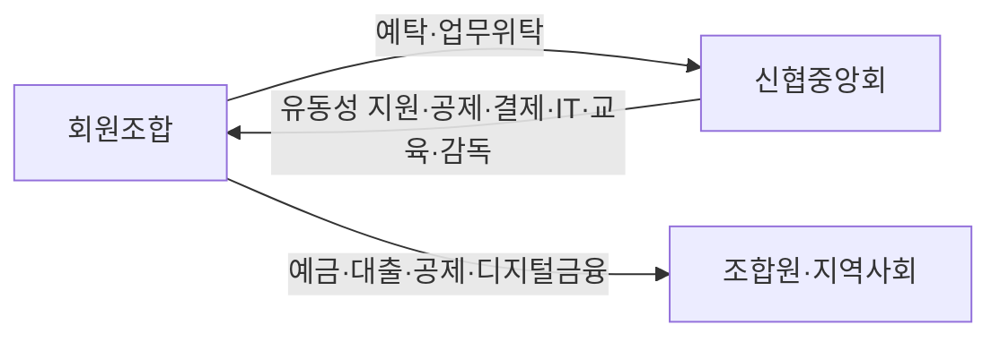

# 신협중앙회 IT 직무분석 리포트

## 요약

신협중앙회 IT 직무는 일반적인 “앱 개발”보다 범위가 넓은 상호금융 플랫폼 운영 직무에 가깝다. 중앙회는 전국 회원조합의 결제·전자금융·공제·정보보호 인프라를 책임하기 때문에, 개발 역량과 함께 운영 안정성, 보안, 금융규제 이해가 동시에 요구된다. 최근 1년간 FDS 성과 공개와 전자금융 보안 강화 작업은 이 직무의 핵심이 “신기능”보다 “안전하고 끊김 없는 금융서비스”에 있음을 보여준다. citeturn13view0turn14view0turn19view0turn26search0turn28search0turn6view0

## 기업 개요와 비즈니스 모델

신협중앙회는 회원조합을 지도·감독·지원하는 중앙조직이자, 조합의 여유자금을 예탁받아 유동성을 조절하고 대출·자금운용을 수행하며, 공제사업과 결제·전자금융 서비스를 제공하는 상호금융 허브다. 2024년 말 기준 신협 네트워크는 전국 866개 조합, 조합원 669만9천 명, 총자산 152.8조원 규모이며, 중앙회는 중앙본부 3부문 17본부와 12개 지역본부로 운영된다. IT 측면에서는 IT이사 산하에 IT기획관리본부, 중앙회IT개발본부, 조합IT개발본부, 정보보호실이 편제돼 있어 개발·운영·보안이 핵심 기능으로 독립 운영된다. citeturn14view0turn15view0turn13view0

공식 자료를 종합하면 중앙회의 비즈니스 모델은 **조합 지원형 B2B2C 구조**에 가깝다. 직접 고객은 회원조합이고, 최종 고객과 수혜자는 조합원·지역사회다. 주요 서비스는 타행 송수금, CD/ATM, 지로, CMS, 인터넷·모바일뱅킹, 인터넷공제 등 24시간 365일 전자금융이며, 2025년 결산 공시상 주요 수익 계정도 이자수익, 수수료수익, 재공제수익, 배당금수익 등으로 확인된다. 즉 수익원은 **신용사업 수익 + 공제 관련 수익 + 결제·전자금융 서비스 수익**으로 요약할 수 있다. citeturn13view0turn18view0turn18view1turn29search0turn30search2

공시된 조직과 업무를 요약하면 다음과 같다. citeturn13view0turn14view0

## 최근 IT 이슈

지난 1년의 대표 이슈는 **전자금융 보안·사기탐지 체계 강화**다. 신협중앙회는 FDS 모니터링실 운영 1년 성과로 2025년 7월 말까지 721건의 의심거래를 차단해 약 73억원의 금융사기 피해를 예방했다고 밝혔다. 실제로 비정상 ATM 연속거래나 악성 앱을 통한 원격조작 사례를 탐지해 타 금융기관·경찰과 연계 대응한 사례도 공개했다. 이 사안은 금융감독원·금융보안원이 FDS 운영 가이드라인을 마련해 금융권 도입을 권장하는 흐름과도 맞물린다. citeturn19view0turn24view0turn21view0

이 이슈는 일회성이 아니라 현재진행형이다. 신협은 2026년 4월 침해사고 대응훈련을 공지했고, 2026년 6월에는 전자금융 서비스 보안 강화를 위한 정책 적용 작업을 별도 안내하면서 작업 중 서비스 지연이나 일부 오류 가능성을 사전에 공지했다. 즉 신협 IT는 기능 개발보다도 **보안 정책 적용, 서비스 연속성 관리, 이상거래 예방**을 상시적으로 수행해야 한다는 점이 중요하다. 중앙회도 향후 탐지 시나리오 고도화, 전문 인력 확대, 시스템 업그레이드를 지속하겠다고 밝혔다. citeturn26search0turn28search0turn19view0

## IT 직무 요구 역량

공개 채용요건과 최근 보안 이슈를 함께 보면, 신협중앙회 IT 직무는 개발·운영·보안을 분리해서 보기 어렵다. 아래 우선순위는 신협 공식 채용자료와 최근 공개 이슈, 금융보안원 자료를 바탕으로 재구성한 것이다. citeturn6view0turn7view0turn19view0turn21view0turn22search0turn18view2

| 역량              | 설명                                                                                                                                                            | 우선순위 |
| --------------- | ------------------------------------------------------------------------------------------------------------------------------------------------------------- | ---- |
| 금융 코어 개발 역량     | 신입 IT직군은 정보처리기사 또는 C·JAVA·SQL·RDB(Oracle/Tibero)·시스템·N/W·보안 관련 자격 1개 이상을 요구하고, 경력직은 Java 또는 C와 Oracle DB·Unix 서버 기반 개발 경험을 요구한다. citeturn6view0turn7view0 | 상    |
| SQL·알고리즘·시스템 설계 | IT직군 평가는 SW 설계·개발, DB 구축, 프로그래밍, 정보시스템 구축관리 중심이며, 별도 온라인 코딩테스트에서 알고리즘과 SQL을 본다. citeturn6view0                                                             | 상    |
| 인프라·보안·개인정보     | 조직상 인프라운영팀·서비스지원팀·정보보호실이 존재하고, 개인정보보호책임자도 IT이사 산하다. 개발자라도 보안·접근통제·개인정보 보호를 이해해야 한다. citeturn14view0turn23view0                                            | 상    |
| 운영 안정성·사기 대응    | FDS 운영 성과, 침해사고 대응훈련, 전자금융 보안 정책 적용 공지는 장애 대응과 이상거래 차단이 일상 업무임을 보여준다. citeturn19view0turn26search0turn28search0                                          | 상    |
| 협업·문서화·프로젝트 수행  | 필기에서 의사소통·문제해결·조직이해·정보능력을 평가하고, 1차 면접에 개인 PT가 포함된다. 신협 인재상도 몰입·협동·신뢰·변화를 강조한다. citeturn6view0turn18view2                                                  | 중상   |
| 금융규제·조합 이해      | 신협은 조합원 소유와 지역사회 책임을 강조하며, 고객권리·개인신용정보 체계를 별도 공시한다. 전자금융·개인정보·금융소비자보호 규정 이해가 필수적이다. citeturn18view0turn18view1turn23view0                                | 중상   |
| 데이터·AI 활용       | FDS 가이드라인과 금융보안원의 AI 기반 FDS 연구를 고려하면, 로그 분석·이상탐지·데이터 기반 의사결정 역량은 현재는 우대, 장기적으로는 필수에 가까워질 가능성이 크다. citeturn21view0turn22search0                            | 중    |

## 종합 평가

신협중앙회 IT 직무는 “금융 SI형 개발자”와 “운영·보안형 플랫폼 인재”의 중간에 있는 하이브리드 직무로 볼 수 있다. 따라서 지원자는 Java·DB·SQL 기본기 위에 전자금융 보안, 장애·사기 대응, 개인정보·규제 이해, 그리고 조합원 중심 협업 태도까지 함께 준비할수록 직무 적합도가 높다. citeturn6view0turn18view2turn19view0turn23view0